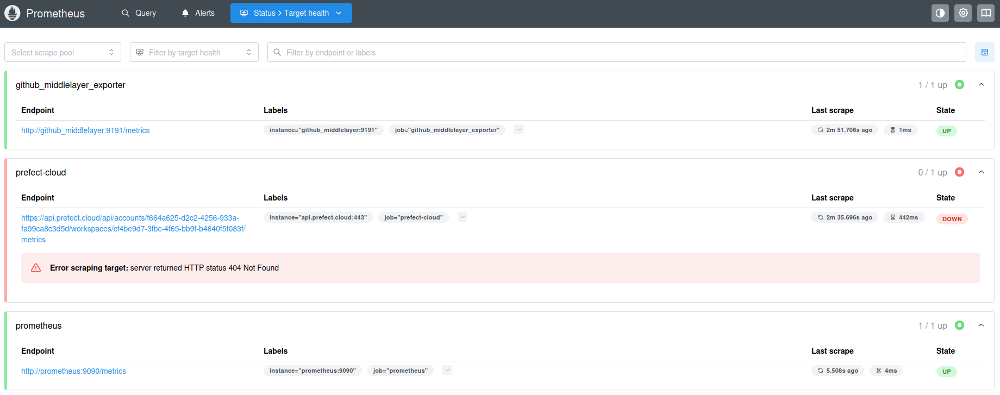
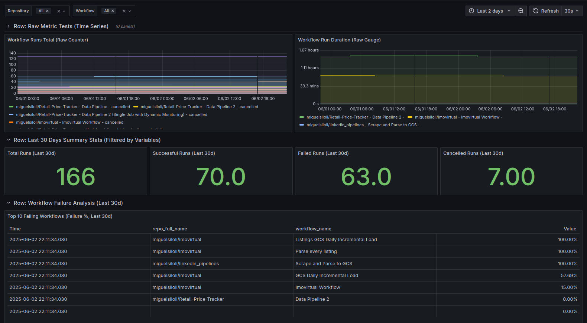

## Prometheus-Grafana overview

*   Why do we *need* to monitor CI/CD and data pipelines?
    *   Slow feedback loops: feedback mainly comes from technical support, client feedback or cascading issues.
    *   Detect failures preemptively: by seting up SLI's we can spot and prevent failures before they even happen
    *   Understanding resource consumption and identifying bottlenecks.
    *   Impact of pipeline health on downstream processes/products.

I'm going to apply Grafana, Prometheus, and how they'll be used with Prefect 2.x and GitHub Actions API as a proof of concept before rolling these changes to our production use cases.

## Part I: Brief stack overview

At the heart of many robust monitoring setups lies the combination of Prometheus for collecting and storing metrics, and Grafana for visualizing and making sense of them.

#### 1.1. Prometheus: The Metric Collector and Time-Series Database

| **Aspect** | **Description** |
|------------|-----------------|
| **Purpose** | Open-source monitoring toolkit for collecting time-series metrics |
| **Architecture** | Pull-based model that scrapes HTTP endpoints for metrics |
| **Metric Types** | Counters, Gauges, Histograms, Summaries |
| **Query Language** | PromQL for data selection and aggregation |
| **Key Features** | Labels for dimensionality, Exporters for 3rd-party systems, Optional Alertmanager |
| **Solves** | Reliable metric collection and querying for system observability |

#### 1.2. Grafana: The Visualization and Analytics Platform

| **Aspect** | **Description** |
|------------|-----------------|
| **Purpose** | Open-source platform for creating dynamic monitoring dashboards |
| **Core Components** | Dashboards (collections of panels), Data Sources, Variables |
| **Data Sources** | Connects to Prometheus, Elasticsearch, MySQL, AWS CloudWatch, etc. |
| **Key Features** | Interactive panels, built-in alerting, templating, extensible plugins |
| **Querying** | Uses native query languages (PromQL, SQL, etc.) |
| **Solves** | Unified visualization platform for diverse data sources |

#### 1.3. Basic Setup 

```{mermaid}
graph TD
    A[Applications/Services] -->|Expose Metrics| B(Metrics Endpoints and Exporters)
    B -->|Prometheus Scrapes| C[Prometheus Server]
    C -->|Stores Time-Series Data| C
    C -->|Grafana Queries PromQL| D[Grafana Server]
    D -->|Renders Dashboards| E[Users Browser]
    C -->|Alerts Optional| F[Alertmanager]
    F -->|Notifications| G[Notification Channels Slack Email]

    classDef default fill:#fff,stroke:#333,stroke-width:2px;
```


## Part II: Monitoring Prefect 2.x and GitHub Actions Pipelines

### 2. The Implemented Solution Architecture

**Which indicators do we need?**

To tackle these observability challenges, we designed a solution centered around Prometheus and Grafana, with a custom component to bridge the gap with the GitHub API. Prefect Cloud's native metrics endpoint is also a target for future integration.

```{mermaid}
graph TB
    subgraph HOST["🖥️ Host VM (e.g., GCP Compute Engine)"]
        subgraph DOCKER["🐳 Docker Compose Network"]
            GM["<b>github_middlelayer</b><br/><b>Container</b>"]
            PROM["<b>Prometheus</b><br/><b>Container</b>"]
            GRAF["<b>Grafana</b><br/><b>Container</b>"]
        end
    end
    
    GH[GitHub API<br/>Workflow Data]
    PC[Prefect Cloud API<br/>e.g., /api/.../metrics]
    
    %% Main flow
    GH -->|HTTP API Calls<br/>Authenticated by PAT| GM
    GM -->|Exposes /metrics<br/>:9191/metrics| PROM
    PROM -->|PromQL Queries<br/>Data Source| GRAF
    
    %% Additional functionality
    GM -.->|"- Fetches GitHub data<br/>- Converts to Prometheus metrics<br/>- Exposes /metrics"| GM
    PROM -.->|"Metrics Storage<br/>& PromQL Engine"| PROM
    GRAF -.->|"User UI<br/>& Alerts"| GRAF
    
    %% Optional Prefect path
    PC -.->|Scrapes /metrics<br/>Authenticated by Key| PROM
    
    %% Styling
    classDef container fill:#2e7d32,stroke:#1b5e20,stroke-width:3px,color:#ffffff
    classDef api fill:#f3e5f5,stroke:#4a148c,stroke-width:2px
    classDef optional fill:#fff3e0,stroke:#e65100,stroke-width:2px,stroke-dasharray: 5 5
    classDef hostvm fill:#bbdefb,stroke:#1976d2,stroke-width:2px
    classDef dockernet fill:#c8e6c9,stroke:#388e3c,stroke-width:2px
    
    class GM,PROM,GRAF container
    class GH,PC api
    class PC optional
    class HOST hostvm
    class DOCKER dockernet
```

**Filesystem structure**

```plaintext
/home/miguel/Projects/grafana+prometheus/
├── project.html
├── project.md
└── monitoring-stack/
    ├── docker-compose.yml
    ├── package.json
    ├── package-lock.json
    ├── github_middlelayer/
    │   ├── app.py
    │   ├── Dockerfile
    │   └── requirements.txt
    ├── grafana_provisioning/
    │   ├── dashboards/
    │   │   ├── dashboard_provider.yml
    │   │   └── github_actions_overview.json
    │   └── datasources/
    │       └── datasource.yml
    └── prometheus_config/
        └── prometheus.yml
```

**Explanation of Architecture Components:**

<table>
<thead>
<tr>
<th>Component</th>
<th>Explanation</th>
</tr>
</thead>
<tbody>
<tr>
<td><strong>Data Sources:</strong></td>
<td>
<strong>GitHub API:</strong> This is our primary source for CI/CD pipeline execution data. We query it for workflow run statuses (success, failure, cancelled), durations, names, and associated repository information.<br/>
<strong>Prefect Cloud API <code>/metrics</code>:</strong>
</td>
</tr>
<tr>
<td><strong><code>github_middlelayer</code> (Custom Prometheus Exporter):</strong></td>
<td>
<strong>Role & Necessity:</strong> Since Prometheus cannot directly parse the JSON responses from the GitHub API, this custom Flask application (served by Gunicorn) acts as an essential
</td>
</tr>
<tr>
<td><strong>Prometheus Container:</strong></td>
<td>
<strong>Scraping:</strong> Configured via <code>prometheus.yml</code> to scrape the <code>/metrics</code> endpoint of our <code>github_middlelayer</code> service and (eventually) the Prefect Cloud metrics endpoint.
</td>
</tr>
<tr>
<td><strong>Grafana Container:</strong></td>
<td>
<strong>Data Source:</strong> Connects to our Prometheus instance (using the internal Docker network service name <code>http://prometheus:9090</code>).
</td>
</tr>
<tr>
<td><strong>Docker Compose:</strong></td>
<td>
<strong>Orchestration:</strong> We use Docker Compose to define, configure, and run our multi-container application (Prometheus, Grafana, <code>github_middlelayer</code>) on a single host Virtual Machine.
</td>
</tr>
<tr>
<td><strong>Host VM (e.g., GCP Compute Engine):</strong></td>
<td>
Provides the underlying compute resources for running our Dockerized monitoring stack.
</td>
</tr>
</tbody>
</table>
<br/>

### 3. Configuration Deep Dive

Setting up this stack involves configuring each component to work in concert.

*   **3.1. `github_middlelayer` (Flask App) Metrics:**
    Our custom exporter is designed to expose several key metrics:
    *   `github_actions_workflow_runs_total_beta_total` (Counter): Tracks the total number of *completed* GitHub Actions workflow runs. It has labels for `repo_full_name`, `workflow_name`, `status` (always "completed" for this counter as implemented), and `conclusion` (e.g., "success", "failure", "cancelled"). This allows us to calculate rates and trends of different outcomes.
    *   `github_actions_workflow_run_duration_seconds_beta` (Gauge): Reports the duration of the most recently *completed* run for each workflow, labeled by `repo_full_name`, `workflow_name`, and `conclusion`. This helps track performance.
    *   `github_exporter_api_requests_total_beta` & `github_exporter_api_request_errors_total_beta` (Counters): Track total API calls and errors encountered by the exporter.

*   **3.2. Prometheus Configuration (`prometheus.yml`):**
    The `scrape_configs` section in `prometheus.yml` is where we tell Prometheus what to monitor.
```yaml
global:
  scrape_interval: 180s
  evaluation_interval: 180s

scrape_configs:
  - job_name: 'prefect-cloud'
    scheme: https
    authorization:
      type: Bearer
      credentials: ""
    static_configs:
      - targets: ['api.prefect.cloud']
    relabel_configs:
      - source_labels: [__address__]
        target_label: __address__
        replacement: "api.prefect.cloud:443"
      - source_labels: [__address__]
        target_label: __metrics_path__
        replacement: "/api/accounts//workspaces/metrics"

  - job_name: 'prometheus'
    static_configs:
      - targets: ['prometheus:9090']


  - job_name: 'github_middlelayer_exporter'
    scrape_interval: 180s # Or match your EXPORTER_SCRAPE_INTERVAL if desired, but can be different
    static_configs:
      # Docker Compose will resolve 'github_middlelayer' to the container's IP
      # on the 'monitor-net' network.
      - targets: ['github_middlelayer:9191']
```

*   **3.3. Grafana Provisioning:**
    To ensure our Grafana setup is repeatable and version-controlled, we utilize its provisioning capabilities:
    *   **Data Sources (`grafana_provisioning/datasources/datasource.yml`):** A YAML file defines the Prometheus data source, specifying its name, type, and URL (`http://prometheus:9090`). Grafana automatically configures this on startup.
    *   **Dashboards (`grafana_provisioning/dashboards/`):**
        *   A `dashboard_provider.yml` tells Grafana to load dashboard definitions from a specific directory.

*   **3.4. Other Important Considerations:**
    *   **Scrape Intervals:** We've set Prometheus to scrape the `github_middlelayer` every 30 seconds. The exporter itself polls the GitHub API less frequently (e.g., every 5 minutes, configurable via `EXPORTER_SCRAPE_INTERVAL`) to respect API limits. This decoupling is important.
    *   **GitHub API Limitations & Mechanics:**
        *   **Rate Limits:** The GitHub API has rate limits (typically 5000 requests/hour for an authenticated PAT). Our exporter logs the remaining limit and exposes it as a metric. For many repositories or very frequent polling, this can become a constraint.
        *   **Pagination:** The API returns paginated results (e.g., 30-100 items per page). The exporter handles this by following `Link` headers to fetch all necessary data.
    *   **API Depletion Mitigation & Caching Suggestion:**
        Currently, our exporter makes fresh API calls each `EXPORTER_SCRAPE_INTERVAL`. To further reduce API load and improve resilience, a caching layer could be introduced within the `github_middlelayer`.
        *   **Options:**
            *   **External Persistent Cache (e.g., Redis):** More robust, survives exporter restarts, but adds another service to manage.

### 4. Conclusions: Visualizing Pipeline Health in Grafana

**Prometheus:**
> Prometheus setting.


> **[Screenshot of Stacked Bar Chart: Run Counts by Conclusion, Stacked by Project]**



This is just an example. Note that `github_actions_workflow_runs_total_beta_total` in the middleware api is not well implemented because there are more workflow states than those (running, scheduled), hence the fact total workflows sum doesn't match.

