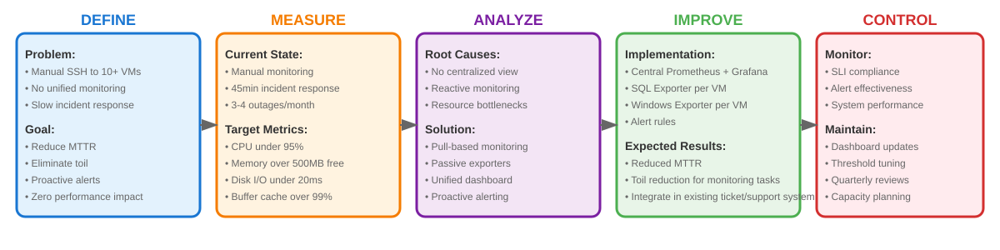
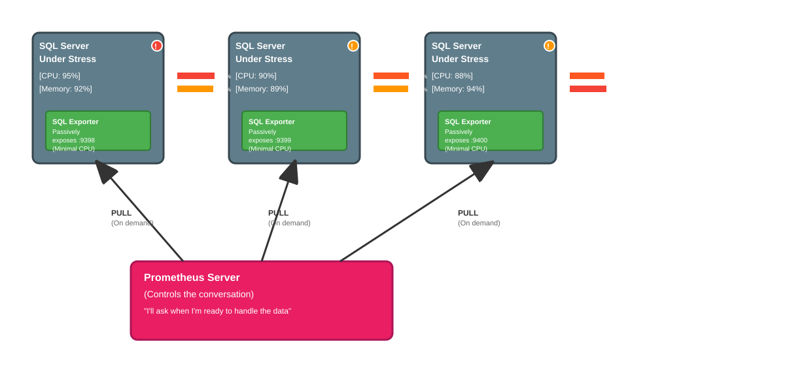
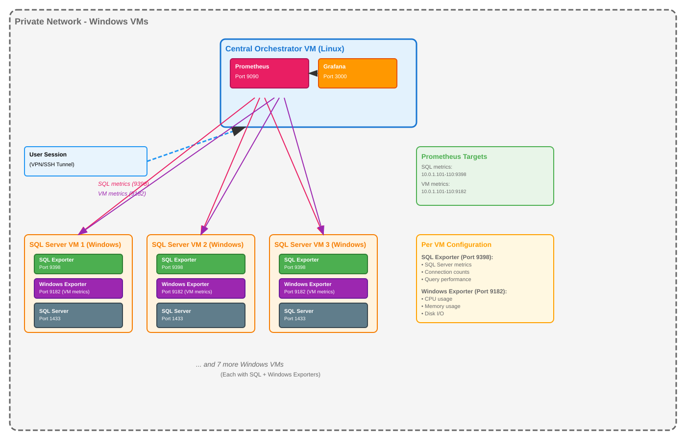
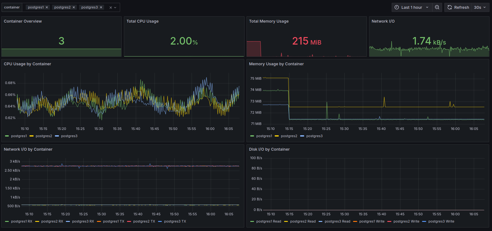
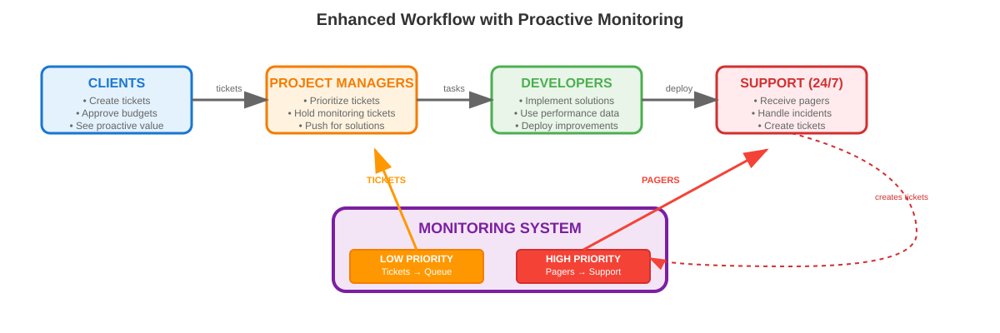

## SQL servers \& VMware observability

In the current setup we have 10+ different VM's, each with a SQL Server node, spread accross factory plants. It's very hard to monitor the infrastructure and SQL Server SLO's, specially during specific events (rollover of new changes, deployments, etc). We need to ssh to each machine and monitor the status of each machine/server and it's a pain.

I propose the following objectives:

- **Toil reduction** - eliminating repetitive manual monitoring tasks
- **Incident response** - faster MTTR (Mean Time To Recovery) through better observability and alerts
- **Reliability engineering** - using data to make systems more reliable (ensure there is enough disk space and physical resources to satisfy the workloads)
- **Tracking VM's user metrics** - it's very common to have users with "sleeping" sessions, consuming RAM and clogging up other processes

We also propose an overarching goals of:
- **Alert system** - not only alert the support colleagues about SQL/functional issues but infrastructure concerns (as issues are often cascading if you consider infrastructure the bottleneck)
- **Integrate the system in the team Ticket system** - priority tasks trigger action by support team (usually tasks which result in operational issues), non priority tasks go to a backlog of Tickets (care client approval)

Other objectives not in the scope (future work):
- **Text based logging** - we have a table COMMON.ERROR_LOG, which records the messages for failed runs (mainly stored procedures)

We propose the usage of prometheus + grafana, to pull data into a unified server which will host these tools and use the alerts in grafana to notify the support about system overheating. We also setup a baseline for a better system management, as support for decisions such as splitting workloads accross VM's, scaling requirements, need to clean up/free resources and generally a better way to troubleshoot problems.


>Note: these SLI metrics are fictional as they have different figures within the project context.

### Grafana + Prometheus
> Better visibility with near zero performance footprint



One huge concern is to absolutely avoid solutions which can further clog the servers.

- **Pull based system**: Grafana pulls data, not the other way. This is important since in push based system, it's the source server that pushes the data to the consumer. This can generate 2-5% CPU overhead, in servers that already might be struggling. Grafana pulls from Prometheus, and prometheus scrapes the data when available. If Prometheus is busy, it skips the scrape.

- **Passive vs Active Exporters**: Since the Prometheus Exporters are passive by nature, they stand idle unless requested. In comparison, active exporters permanentely allocate a resource overhead to expose the data 24/7.

```plaintext
Traditional Monitoring Agent:
├── Background Service: 50-100MB RAM
├── CPU Usage: 2-5% constantly 
├── Disk I/O: Continuous log writing
├── Network: Constant outbound connections
└── Storage: Local buffering when monitoring is down

SQL Exporter:
├── Memory Usage: 10-20MB RAM
├── CPU Usage: <0.1% (only during scrapes)
├── Disk I/O: None (stateless)
├── Network: Only responds to incoming requests
└── Storage: Zero local storage needed
```

### The Architecture



It's worth to note the infrastructure lives inside the company's VPN, so the sensible solution is to keep it so and allocate a new VM as the orchestrator (Monitor Hub) and ssh this machine for infrastructure visibility. Each VM will have an exporter daemon to access as the metrics endpoint interface between SQL Server as well as Windows metrics and Prometheus.

### SLI's and SLO's

**SQL Server Key Metrics**

| Metric | Purpose | Why You Should Track It |
|--------|---------|-------------------------|
| **Number of Databases** | Inventory & Scope | Good to compare different databases. |
| **Total Database Size** | Capacity Planning | Capacity provisioning and management|
| **Number of User Objects** | Change & Complexity Tracking | Tracking system objects such as views, table and stored procedures. |
| **Number of Stored Procedures** | Code Deployment Tracking | Similar to above, but focused on programmable objects. Useful for correlating a new deployment with a change in performance. |
| **Number of SQL Agent Jobs** | Operational Awareness | Tracks your automation and how jobs affect servers. |
| **Buffer Cache Hit Ratio** | Operational Measure| Shows the percentage of data requests that are served from fast RAM instead of disk. |
| **Active User Connections** | Load & Connection Pooling | Tracks how many connections are active. Helps diagnose connection leaks from applications or validate the health of connection pooling. |

**VMWare Key Metrics**

| User Concern | SLI (The Measurement) | Description |
|--------------|----------------------|-------------|
| **Availability** | VM Uptime | The percentage of time the virtual machine's operating system is running and reachable by the monitoring agent (windows_exporter).|
| **CPU Saturation** | Non-Saturated CPU Time | The percentage of time that the total CPU usage is below a critical threshold (e.g., 95%). This directly measures whether the VM has sufficient CPU headroom to service new requests without queuing, which prevents application-level latency. |
| **Memory Saturation** | Sufficient Memory Availability Rate | The percentage of time the operating system has more than a minimum required amount of free physical memory (e.g., 500MB). |
| **Disk Latency** | Fast Disk I/O Rate | The percentage of individual disk read and write operations that complete under a specific latency threshold (e.g., 20 milliseconds). |
| **Disk Saturation** | Non-Saturated Disk Time | The percentage of time that the disk queue (the number of I/O requests waiting to be serviced) is below a low threshold (e.g., 2). This indicates the storage can keep up with the demand from the application without causing I/O waits. |

**SQL Server Alert System**

| Metric | High-Urgency Condition (Pager) | Low-Urgency Condition (Ticket/Slack) |
|--------|--------------------------------|--------------------------------------|
| **VM Uptime (Availability)** | VM is down for more than 3 minutes | (Not applicable. This is a binary state.) |
| **CPU Saturation** | Total CPU Usage > 95% for more than 10 minutes | Total CPU Usage > 85% for more than 60 minutes |
| **Memory Saturation** | Available Memory < 500MB for more than 5 minutes | Available Memory < 1GB for more than 30 minutes |
| **Disk Saturation** | Disk Queue Length > 10 for more than 5 minutes | Disk Queue Length > 2 for more than 15 minutes |
| **Disk Latency** | Average Disk Latency > 100ms for more than 5 minutes | Average Disk Latency > 20ms for more than 30 minutes |

**Windows Alert System**

| Metric | High-Urgency Condition (Pager) | Low-Urgency Condition (Ticket/Slack) |
|--------|--------------------------------|--------------------------------------|
| **VM Uptime (Availability)** | VM is down for more than 3 minutes | (Not applicable. This is a binary state.) |
| **CPU Saturation** | Total CPU Usage > 95% for more than 10 minutes | Total CPU Usage > 85% for more than 60 minutes |
| **Memory Saturation** | Available Memory < 500MB for more than 5 minutes | Available Memory < 1GB for more than 30 minutes |
| **Disk Saturation** | Disk Queue Length > 10 for more than 5 minutes | Disk Queue Length > 2 for more than 15 minutes |
| **Disk Latency** | Average Disk Latency > 100ms for more than 5 minutes | Average Disk Latency > 20ms for more than 30 minutes |
| **Active User Connections** | Number of connections > Max Pool Size + 20% for more than 2 minutes | (Not typically needed. Connection counts are usually either normal or pathologically high.) |
| **Buffer Cache Hit Ratio** | (Not recommended as a high-urgency alert.) | Buffer Cache Hit Ratio < 95% for more than 15 minutes |

### Coupling changes into Organizational Dynamics

## Docker Compose Mockup

In order to test this architecture, we created a mockup with docker compose. We spin off a couple of SQL Server containers, cAdvisor to monitor container metrics and SQL Server exporter image.


### Setup

- 3 SQL server containers
- 3 Exporter containers
- 1 cAdvisor container
- 1 grafana container
- 1 prometheus container
- A simple powershell code to mimick some work in the database containers

**Screenshots**



## Conclusion



All in all, we show how the implementation of these solutions links to the **organization**. We don't only throw some tech stack into it, we considered the functional concerns of Senior Engineers (functional requirements and minimizing overhead), we fit into the team budget leveraging existential capabilities and we also propose a framework to integrate the stakeholders and collaborators by incorporating into the Pager/Ticket system.

