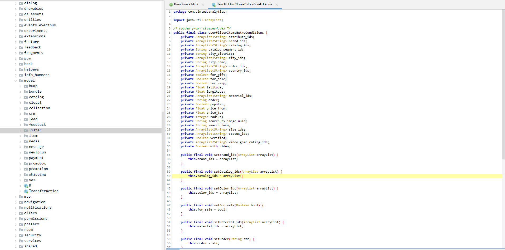
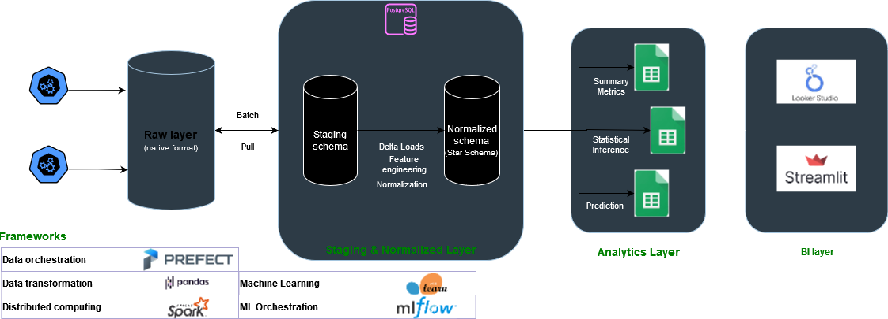

# Overview of the Data Pipeline

## Data source: API

The first step of the pipeline is the source of the data. The source of the data in this scenario is the Vinted API which can be accessed by this endpoint: https://www.vinted.pt/api/v2/users/77283267/items

#### APK Decompiling and API endpoints

We can download some  the APK from the Vinted app store and decompile it with [apktool](https://ibotpeaches.github.io/Apktool/).

```bash
apktool d vinted.apk
```

Other alternatives are:
- Dex2jar
- Jadx

##### APK Decompiled

Once the app is decompiled look into words such as 'api', 'latitude', 'brand_ids', 'rest', 'status', etc.



##### Useful Endpoints

``` json
params = {
    "search_text": "+".join(
        map(str, [tpl[1] for tpl in querys if tpl[0] == "search_text"])
    ),
    "catalog_ids": ",".join(
        map(str, [tpl[1] for tpl in querys if tpl[0] == "catalog_ids[]"])
    ),
    "color_ids": ",".join(
        map(str, [tpl[1] for tpl in querys if tpl[0] == "color_id[]"])
    ),
    "brand_ids": ",".join(
        map(str, [tpl[1] for tpl in querys if tpl[0] == "brand_ids[]"])
    ),
    "size_ids": ",".join(
        map(str, [tpl[1] for tpl in querys if tpl[0] == "size_id[]"])
    ),
    "material_ids": ",".join(
        map(str, [tpl[1] for tpl in querys if tpl[0] == "material_id[]"])
    ),
    "status_ids": ",".join(
        map(str, [tpl[1] for tpl in querys if tpl[0] == "status[]"])
    ),
    "country_ids": ",".join(
        map(str, [tpl[1] for tpl in querys if tpl[0] == "country_id[]"])
    ),
    "city_ids": ",".join(
        map(str, [tpl[1] for tpl in querys if tpl[0] == "city_id[]"])
    ),
    "is_for_swap": ",".join(
        map(str, [1 for tpl in querys if tpl[0] == "disposal[]"])
    ),
    "currency": ",".join(
        map(str, [tpl[1] for tpl in querys if tpl[0] == "currency"])
    ),
    "price_to": ",".join(
        map(str, [tpl[1] for tpl in querys if tpl[0] == "price_to"])
    ),
    "price_from": ",".join(
        map(str, [tpl[1] for tpl in querys if tpl[0] == "price_from"])
    ),
    "page": page,
    "per_page": batch_size,
    "order": ",".join(
        map(str, [tpl[1] for tpl in querys if tpl[0] == "order"])
    ),
    "time": time
}
```

These are our string query params used in the API calls which are currently supported. In practice, I don't use most of them.

##### Limitations

The API doesn't provide a full list of possible params for these query params.

## Overview of Pipeline Design

||
|:--:| 
| Pipeline Schema (proposed) |

### Layers

This pipeline is divided into 3 main stages:

- **Ingestion**: ingestion layer is the first ETL layer where we scrap raw data from the source and store in s3 buckets. This first layer should be the simplest, with minimum to no transformations to the raw data.
Data is scrapped in json and is stored in json (**non/semi structured format**).

- **Digestion**: this is the first normalization step where we build staging tables in our RDS and store the data in a structured format for the first time. In a later phase, the data is normalized into a normalized layer. This is where **data modelling** and **data normalization** occurs.

- **Serving**: this is the last step of data transformation. It is where data is aggregated, joined and partitioned according to its semantics and served in an analytics layer. This can be another schema within our RDS (**data mart**).

### Frameworks

This is the initial pipeline schema and it was proposed for its simplicity and to leverage popular frameworks. The main technologies chosen for the project are:

| Category            | Tools            |
|---------------------|------------------|
| Data Orchestration  | Prefect          |
| Data Transformation | Pandas           |
| Distributed Computing | Spark          |
| Machine Learning    | Scikit-learn     |
| ML Orchestration    | MLFlow           |
| Visualization       | Plotly           |
| Model Deployment    | FastAPI          |
| WSGI Server         | Streamlit        |

Cloud infrastructure

| Category            | Tools            |
|---------------------|------------------|
| Object Storage  | S3 object storage    |
| Relational Database | AWS RDS Postgres (DBaaS) |
| Computing infrastructure | AWS EC2 (IaaS) |

### Design choices

#### Data Orchestration

Prefect is a modernized, simpler verson of Airflow which is not only exciting to learn but it also fits well in the Pythonic ecosystem.

| Feature                | Prefect                                  | Airflow                                     |
|------------------------|------------------------------------------|---------------------------------------------|
| Ease of Use            | Simpler syntax and configuration        | Steeper learning curve, more complex setup (Linux based)  |
| DAG Definition         | Python-based with native Python code    | Uses Python but requires additional concepts like Operators and Hooks |
| Error Handling         | Built-in error handling and retries     | Retries require more manual configuration |
| Monitoring             | UI is easier to use | Provides a UI dashboard which has been updated |
| Community Support      | Growing community with active development | Mature community with large user base |
| Ecosystem Integration  | Integrates well with other Python libraries and tools | Provides a vast support for integrations as well |

The most important reasons why I chose Prefect over popular frameworks such as Airflow is it's simplicity, easy setup and configuration and native Python coding. In addition, it's much easier to run on Windows since you don't need to run Docker or windows linux compatibility patch.


In addition, Prefect already provides an extensible support for most frameworks and cloud infrastructure out-of-the-box. For instance, it provides support for Dask, Spark, great-expectations and dbt.


#### Data Manipulation

Pandas is king in Python environments. The only reason I'm switching to other alternatives is due to performance issues (I/O ops or computing). This project doesn't handle huge data volumes.

| Feature              | Pandas                              | Polars                                  | Dask                                 |
|----------------------|-------------------------------------|-----------------------------------------|--------------------------------------|
| Language             | Python                              | Rust (with Python bindings)             | Python                               |
| Backend              | Single-threaded                     | Multi-threaded    | Distributed computing                 |
| Performance          | Fast for small to medium datasets   | Very fast, especially for large datasets | Good for distributed computing       |
| Memory Usage         | Relatively high                     | Lower memory footprint                 | Efficient memory usage               |
| Scalability          | Limited scalability                 | Limited scalability                    | Scales well with distributed computing |
| DataFrame Operations| Extensive operations and functions  | Comprehensive operations and functions | Comprehensive operations and functions|
| Parallel Processing  | Limited parallelism                 | Utilizes multi-threading               | Supports distributed computing       |
| Deployment           | Suitable for single-node deployment | Suitable for single-node deployment    | Suitable for single-node or cluster deployment |
| Community Support    | Large and active community          | Growing community                      | Large and active community           |
| Ease of Use          | Familiar syntax and API             | Familiar syntax and API                | Similar syntax to Pandas, easy to learn |
| Ecosystem Integration| Integrates well with Python libraries and tools | Expanding ecosystem                    | Extensive ecosystem integration      |
| Development Status   | Mature and widely used              | Rapidly evolving                       | Rapidly evolving                      |

**Pandas**

For data manipulation, pandas is the one which provides more flexibility and integration into python libraries, so it's my go to choice. However, there are some great alternatives for data manipulation, specially to deal with huge datasets.


In addition, pandas provides several backends instead of numpy which can further accelerate data manipulation.


**Polars**

I never used Polars before but it has grown in popularity. It has an exciting premise of accelerating data wrangling operations on the same infrastructure using parallel execution.

>  This benchmark aims to replicate data wrangling operations used in practice. Polars easily trumps other solutions due to its parallel execution engine, efficient algorithms and use of vectorization with SIMD (Single Instruction, Multiple Data). Compared to pandas, it can achieve more than 30x performance gains.


source: https://pola.rs/

**Dask**

Dask seems like a step between Polars and Spark. It scales much better than Polars since it uses distributed computing and Dask clusters to process data, but it's not efficient as Spark on very large datasets.

    Just pandas: Dask DataFrames are a collection of many pandas DataFrames.

    The API is the same. The execution is the same.

    Large scale: Works on 100 GiB on a laptop, or 100 TiB on a cluster.

    Easy to use: Pure Python, easy to set up and debug.

source: https://docs.dask.org

I have used Dask before, and there are some functions I really like.

**I/O ops and reads**

By using both the pyarrow engine and datatypes, by partioning the object into smaller chunks, by preemptively passing dataframe structure and  by deferring execution (lazy instantiation) Dask is able to optimize tasks (DAGs) and perform much faster operations.

````python
from dask.distributed import Client
import dask_expr as dd

client = Client()

df = dd.read_csv(
    "measurements.txt",
    sep=";",
    header=None,
    names=["station", "measure"],
    engine='pyarrow',
    dtype_backend='pyarrow'
)
df = df.groupby("station").agg(["min", "max", "mean"])
df.columns = df.columns.droplevel()
df = df.sort_values("station").compute()
````

**Processing data out of memory**

Dask allows you to read several Gigs files into RAM by creating multiple partitions. It also provides a fairly strong API to overcome memory issues such as the ability to delete data, both local and remote and cancel operations on futures/collections.

#### Visualization and Dashboarding

Dash is by far the most exciting dashboarding app right now. It's arguably much harder to use with a steeper learning curve, but its results are remarkable.

However, I find streamlit the easiest tool to use by far altough I dislike some things about it such as it's linear run flow (Dash provides a way to deal with callbacks and responsive components which is much easier). It also doesn't support native JS (altough Dash doesn't either but it's easier to add custome components).

The bottom line is, when creating a product, if you are focusing on Time to Market or developing an MVP, streamlit is much better.


| Feature                | Dash                                        | Streamlit                                   |
|------------------------|---------------------------------------------|---------------------------------------------|
| Type of Tool           | Web application framework for building interactive web applications | Web application framework for building data apps |
| Ease of Use            | Requires knowledge of Python and web development (HTML, CSS, JavaScript) | Extremely easy to use with intuitive Python syntax |
| Interactivity          | Highly interactive with support for complex web applications | Interactive widgets and components for real-time updates |
| Customization          | Highly customizable with full control over layout and components | Limited customization options compared to Dash |
| Deployment             | Can be deployed as standalone web applications or integrated into existing web apps | Simple deployment process with built-in support for sharing via URL or Docker |
| Community Support      | Large and active community with extensive documentation and resources | Rapidly growing community with increasing adoption and resources |
| Backend Technology     | Based on Flask and ReactJS                    | Based on Python with built-in support for machine learning and data processing |
| Real-Time Updates      | Supports real-time updates and data streaming with WebSocket integration | Supports real-time updates with automatic reactivity |
| Machine Learning       | Can be integrated with machine learning models for dynamic visualizations | Built-in support for machine learning libraries and model integration |

