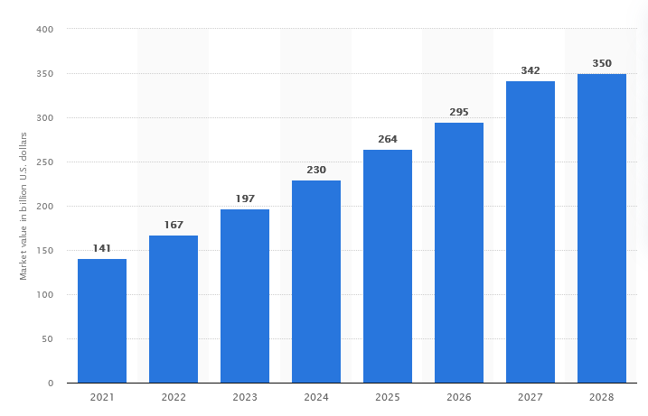
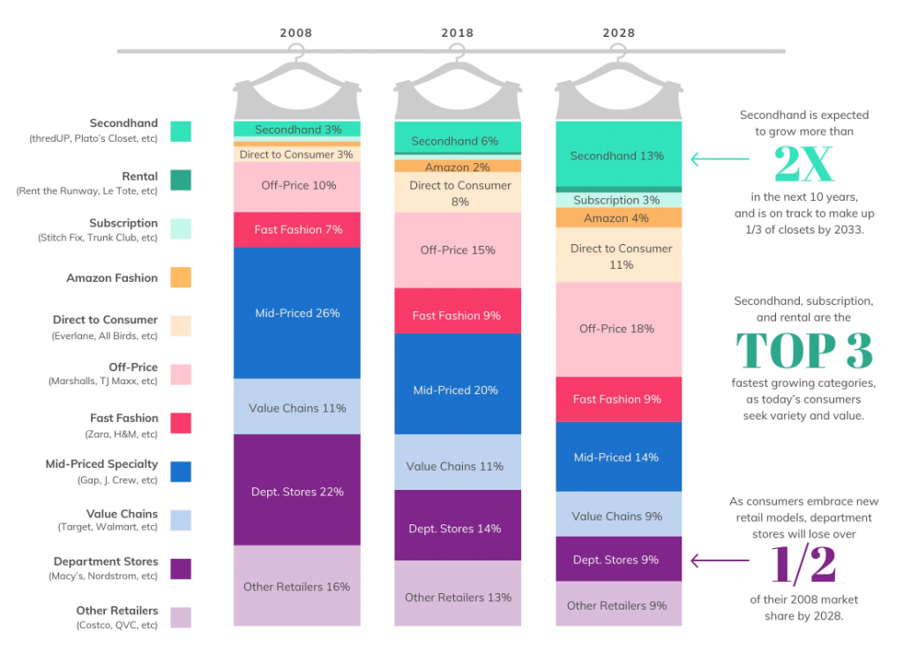

# 01: Overview of the Vinted Project

- [01: Overview of the Vinted Project](#01-overview-of-the-vinted-project)
  - [Introduction to the Vinted Project](#introduction-to-the-vinted-project)
    - [Vinted as a seller](#vinted-as-a-seller)
  - [Overview of Pipeline Design](#overview-of-pipeline-design)
    - [Requirements overview](#requirements-overview)
    - [Layers](#layers)
    - [Frameworks](#frameworks)
    - [Cloud infrastructure](#cloud-infrastructure)


## Introduction to the Vinted Project


Vinted is a popular online marketplace that connects buyers and sellers of second-hand clothing, shoes, accessories, and other fashion items. It is a Lithuania-based online marketplace founded in 2008, specializing in second-hand clothing, shoes, accessories, and other fashion items. According to Statista, the global second-hand apparel market was valued at approximately \$200 billion in 2024 and is projected to reach \$350 billion by 2028, representing a compound annual growth rate (CAGR) of 15.5%.


**Vinted is one of Europe's hottest startups**.

> In 2021, Vinted raised \$303 million in Series F funding, valuing the company at over $4 billion and cementing its position as one of Europe's leading tech startups.

**Vinted is ESG friendly**

In addition, Vinted is a good alternative for growth investors seeking companies complying with Europe's ESG (environmental, social and corporate responsibilities).
> Vinted promotes sustainable fashion practices by extending the lifecycle of clothing and reducing the environmental impact of the fashion industry.

> According to Vinted's Sustainability Report, the platform helped save approximately 35,000 tons of CO2 emissions in 2020 through the sale of second-hand items.



Second hand clothing are on their way to dethrone mid and low tier clothing brands. Both cheap off price retailers and high end luxury should be safe. This marks a **new generation of customer behavior**.

> Millennials and Generation Z consumers, in particular, are driving the demand for sustainable fashion and are active participants on platforms like Vinted.



### Vinted as a seller
From a sellers perspective, the main focus points are:

- Easy listings process: Vinted provides a user-friendly platform where you can easily list your pre-owned clothing, shoes, accessories, and other fashion items for sale.
- Ability to reach a large audience: By selling on Vinted, you gain access to a large and diverse audience of potential buyers.
- Affordable selling fees
- Seller (and buyer) protection
- Direct communication with buyers
- Feedback and ratings system

## Overview of Pipeline Design

||
|:--:| 
| Pipeline Schema (proposed) |

### Requirements overview

Our data pipeline wants to capture:
- [x] the stream of new items being added to Vinted’s marketplace in real time
- [x] a system to track these items over time
- [x] a system to store and label images from products

The purpose of this project is to create an underlying structure to allow ad hoc analysis. Some of the most important analysis are:

- **Get product statistics with aggregations**: the ability to provide the user an idea of average price by product categories, different sizes, different item conditioning, etc.
- **Get a sense of existing and future trends**: this requires a longitudinal approach where we not only collect the data at a certain point in time, but we continuously track this data with snapshots accross time.
- **Get product sales** factors: this goes with the idea above, which is the ability to track products and detect when they were sold.
- **Build Dashboards**: Dashboards are built on Cubes or other OLAP solutions for aggregated queries.
- **Build ML solutions**: the idea which comes to mind is the ability to predict product trends or price regression.

```{mermaid}
graph TD
    actor[User]

    actor --> A(Get product descriptive statistics)
    actor --> B(Get product trends)
    actor --> C(Get product sales factors)
    actor --> D(Build Dashboards)
    actor --> E(Build ML solutions)
```

### Layers

This pipeline is divided into 3 main stages:

| **Layer**   | **Description**                                                                                                                                                                                                                     | **Details**                                                                                                     |
|-------------|-------------------------------------------------------------------------------------------------------------------------------------------------------------------------------------------------------------------------------------|-----------------------------------------------------------------------------------------------------------------|
| **Raw**  | The raw layer is the first ETL layer where we scrape raw data from the source and store it in S3 buckets. This first layer should be the simplest, with minimal to no transformations to the raw data. Data is scraped in JSON format and stored in JSON. | - **Source**: Raw data<br>- **Storage**: S3 buckets<br>- Format: JSON                                                   |
| **Staging**  | The staging layer is the first normalization step where we build staging tables in our RDS and store the data in a structured format for the first time. In a later phase, the data is normalized into a normalized layer. This is where **data modeling** and **data normalization** occur. | - **Source**: Staging tables<br>- **Storage**: RDS<br>- **Processes**: Data modeling, data normalization                   |
| **Serving**    | The serving layer is the final step of data transformation. It is where data is aggregated, joined, and partitioned according to its semantics and served in an analytics layer. This can be another schema within our RDS (**data mart**).                              | - **Source**: Aggregated data<br>- **Storage**: Analytics layer, data mart<br>- **Processes**: Aggregation, joining, partitioning |


### Frameworks

This is the initial pipeline schema and it was proposed for its simplicity and to leverage popular frameworks. The main technologies chosen for the project are:

| Category            | Tools            |
|---------------------|------------------|
| Data Orchestration  | Prefect          |
| Data Transformation | Pandas           |
| Distributed Computing | Spark          |
| Machine Learning    | Scikit-learn     |
| Visualization       | Plotly           |
| WSGI Server         | Streamlit        |

### Cloud infrastructure

| Category            | Tools            |
|---------------------|------------------|
| Object Storage  | S3 object storage    |
| Relational Database | AWS RDS Postgres (DBaaS) |
| Computing infrastructure | AWS EC2 (IaaS) |

