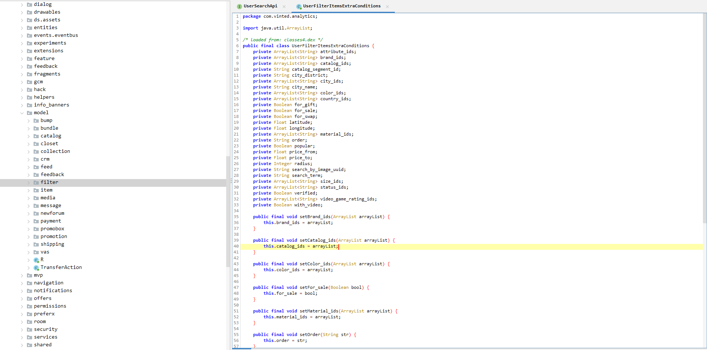

# 02: Vinted API

- [02: Vinted API](#02-vinted-api)
  - [Data source: API](#data-source-api)
      - [APK Decompiling and API endpoints](#apk-decompiling-and-api-endpoints)
        - [APK Decompiled](#apk-decompiled)
        - [Useful Endpoints](#useful-endpoints)
        - [Limitations](#limitations)
  - [Singleton Requester](#singleton-requester)
  - [Vinted Endpoint Class](#vinted-endpoint-class)
    - [Url Encoding Search params](#url-encoding-search-params)
    - [Search catalog function](#search-catalog-function)
    - [Search item based on user\_id](#search-item-based-on-user_id)
    - [Wrapping up with Vinted class](#wrapping-up-with-vinted-class)
  - [Conclusions](#conclusions)

## Data source: API

The first step of the pipeline is the source of the data. The source of the data in this scenario is the Vinted API which can be accessed by this endpoint: https://www.vinted.pt/api/v2/users/77283267/items

#### APK Decompiling and API endpoints

We can download some  the APK from the Vinted app store and decompile it with [apktool](https://ibotpeaches.github.io/Apktool/).

```bash
apktool d vinted.apk
```

Other alternatives are:
- Dex2jar
- Jadx

##### APK Decompiled

Once the app is decompiled look into words such as 'api', 'latitude', 'brand_ids', 'rest', 'status', etc.

||
|:--:| 
|Reverse engineer of the Vinted search params using apktool.|

##### Useful Endpoints

``` json
params = {
    "search_text": "+".join(
        map(str, [tpl[1] for tpl in querys if tpl[0] == "search_text"])
    ),
    "catalog_ids": ",".join(
        map(str, [tpl[1] for tpl in querys if tpl[0] == "catalog_ids[]"])
    ),
    "color_ids": ",".join(
        map(str, [tpl[1] for tpl in querys if tpl[0] == "color_id[]"])
    ),
    "brand_ids": ",".join(
        map(str, [tpl[1] for tpl in querys if tpl[0] == "brand_ids[]"])
    ),
    "size_ids": ",".join(
        map(str, [tpl[1] for tpl in querys if tpl[0] == "size_id[]"])
    ),
    "material_ids": ",".join(
        map(str, [tpl[1] for tpl in querys if tpl[0] == "material_id[]"])
    ),
    "status_ids": ",".join(
        map(str, [tpl[1] for tpl in querys if tpl[0] == "status[]"])
    ),
    "country_ids": ",".join(
        map(str, [tpl[1] for tpl in querys if tpl[0] == "country_id[]"])
    ),
    "city_ids": ",".join(
        map(str, [tpl[1] for tpl in querys if tpl[0] == "city_id[]"])
    ),
    "is_for_swap": ",".join(
        map(str, [1 for tpl in querys if tpl[0] == "disposal[]"])
    ),
    "currency": ",".join(
        map(str, [tpl[1] for tpl in querys if tpl[0] == "currency"])
    ),
    "price_to": ",".join(
        map(str, [tpl[1] for tpl in querys if tpl[0] == "price_to"])
    ),
    "price_from": ",".join(
        map(str, [tpl[1] for tpl in querys if tpl[0] == "price_from"])
    ),
    "page": page,
    "per_page": batch_size,
    "order": ",".join(
        map(str, [tpl[1] for tpl in querys if tpl[0] == "order"])
    ),
    "time": time
}
```

These are our string query params used in the API calls which are currently supported. In practice, I don't use most of them.

##### Limitations

The API doesn't provide a full list of possible params for these query params.


## Singleton Requester

While singletons can be implemented in various ways, they typically involve a static method or property that returns the sole instance of the class. Singletons are often used for managing resources that should be shared across the entire application, such as a database connection pool or a configuration manager.

**Definition**
> Ensure a class has one instance, and provide a global point of access to it.

The base class for the API is a custom implementation of Requests library. The purpose of this class is to:

- Extend class behaviors, adding custom behaviors such as setCookies/authentification
- Throttle the amount of requests
- Limit the amount of sessions, sharing a single state accross the application
- Global configuration of headers, cookies and other session params

```{caution}
**Why singleton can be considered an anti-pattern**

> However, if we were to later modify the architecture to use multiple threads to handle many requests within a single instance of the application, this assumption suddenly turns out to be false, and it becomes necessary to rework the code significantly to handle this new condition.

For this instance, async requests are far fetched as of now because Vinted is rate limiting our requests. But assuming we develop some alternative solutions such as the ability to route requests through a proxy middle ware, this base class would need some serious reworking.

> Coupled architectures often arise when modules rely heavily on global state, singletons, or shared mutable state.

Singletons encourage coupled architectures as they share a global state accross the application
```

## Vinted Endpoint Class


### Url Encoding Search params

All the searching params we found using the reverse engineering of the Vinted API are going into a utility function.
This function is nothing but an interface between the browser search url and the corresponding api endpoint url.

- URL: https://www.vinted.pt/catalog/2657-espadrilles
- Endpoint API: https://www.vinted.pt/api/v2/items?catalog[]=2657


```python
def parseUrl(self, url, batch_size=20, page=1, time=None) -> Dict:
    """
    Parse Vinted search url to get parameters the for api call.

    Args:
        url (str): The url of the research on vinted.
        batch_size (int): Number of items to be returned (default 20).
        page (int): Page number to be returned (default 1).

    """
    querys = parse_qsl(urlparse(url).query)

    params = {
        "search_text": "+".join(
            map(str, [tpl[1] for tpl in querys if tpl[0] == "search_text"])
        ),
        "catalog_ids": ",".join(
            map(str, [tpl[1] for tpl in querys if tpl[0] == "catalog_ids[]"])
        ),
        "color_ids": ",".join(
            map(str, [tpl[1] for tpl in querys if tpl[0] == "color_id[]"])
        ),
        "brand_ids": ",".join(
            map(str, [tpl[1] for tpl in querys if tpl[0] == "brand_ids[]"])
        ),
        "size_ids": ",".join(
            map(str, [tpl[1] for tpl in querys if tpl[0] == "size_id[]"])
        ),
        "material_ids": ",".join(
            map(str, [tpl[1] for tpl in querys if tpl[0] == "material_id[]"])
        ),
        "status_ids": ",".join(
            map(str, [tpl[1] for tpl in querys if tpl[0] == "status[]"])
        ),
        "country_ids": ",".join(
            map(str, [tpl[1] for tpl in querys if tpl[0] == "country_id[]"])
        ),
        "city_ids": ",".join(
            map(str, [tpl[1] for tpl in querys if tpl[0] == "city_id[]"])
        ),
        "is_for_swap": ",".join(
            map(str, [1 for tpl in querys if tpl[0] == "disposal[]"])
        ),
        "currency": ",".join(
            map(str, [tpl[1] for tpl in querys if tpl[0] == "currency"])
        ),
        "price_to": ",".join(
            map(str, [tpl[1] for tpl in querys if tpl[0] == "price_to"])
        ),
        "price_from": ",".join(
            map(str, [tpl[1] for tpl in querys if tpl[0] == "price_from"])
        ),
        "page": page,
        "per_page": batch_size,
        "order": ",".join(
            map(str, [tpl[1] for tpl in querys if tpl[0] == "order"])
        ),
        "time": time
    }
    filtered = {k: v for k, v in params.items() if v not in ["", None]}

    return filtered
```

### Search catalog function

A function to query the endpoint for a particular catalog_id.

```python
def search_catalog(self, url, batch_size: int = 10, page: int =1) -> pd.DataFrame:
    """
    Retrieves items from a given catalog number.

    Args:
        url (str): The url of the research on vinted.
        batch_size (int): Number of items to be returned (default 20).
        page (int): Page number to be returned (default 1).

    """

    params = self.parseUrl(url, batch_size, page)
    url = f"{Urls.VINTED_BASE_URL}/
            {Urls.VINTED_API_URL}/
            {Urls.VINTED_PRODUCTS_ENDPOINT}?{urllib.parse.urlencode(params)}"

    response = requester.get(url=url)

    try:
        response.raise_for_status()
        items = response.json()
        
        df = pd.DataFrame(items["items"])
        df["catalog_total_items"] = items["pagination"]["total_entries"]

        return (df)

    except HTTPError as err:
        raise err
```

An extension of search_catalog was made in order to fit the custom arguments from Prefect tasks. (temporary solution)

```python
def search_all(self, nbrRows, *args, **kwargs):
    nbrpages = round(nbrRows/kwargs["batch_size"])
    df_list = []
    for _page in range(1, nbrpages + 1):
        d = self.search_catalog(*args, **kwargs, page = _page)
        if d.empty:
            return
        df_list.append(d)

    return(pd.concat(df_list, axis = 0, ignore_index=True))
```


### Search item based on user_id

This is the most used endpoint and it targets user profiles. The reason why it's the most used endpoint right now is because it returns much more detailed product data then searches by product params that we often do in the Vinted searching text box.

In addition, with only 1 request we are able to obtain data for the user_id as well.

```python
def search_item(self, user_id, time: int = None) -> pd.DataFrame:
    """
    Retrieves items from a given search url on vinted.

    Args:
        user_id (str): The ID of the user whose items are to be retrieved.
        time (int): Time parameter (default None).

    Returns:
        pd.DataFrame: A DataFrame containing information about the items retrieved.
    """
    #endbyte = random.choice(["%00", "%0d%0a", "%0d", "%0a", "%09", "%0C"])
    # Randomly select a user agent
    user_agent = random.choice([
        "Mozilla/5.0 (Linux; Android 11; SM-G991B Build/RP1A.200720.012; wv) AppleWebKit/537.36 (KHTML, like Gecko) Chrome/91.0.4472.120 Mobile Safari/537.36",
        "Mozilla/5.0 (iPhone; CPU iPhone OS 14_6 like Mac OS X) AppleWebKit/605.1.15 (KHTML, like Gecko) Version/14.1 Mobile/15E148 Safari/604.1",
        "Mozilla/5.0 (Windows NT 10.0; Win64; x64; rv:89.0) Gecko/20100101 Firefox/89.0",
        "Mozilla/5.0 (Windows NT 10.0; Win64; x64) AppleWebKit/537.36 (KHTML, like Gecko) Chrome/91.0.4472.124 Safari/537.36"
    ])
    
    # Construct the URL to retrieve user items
    url = f"{Urls.VINTED_BASE_URL}/{Urls.VINTED_API_URL}/users/{user_id}/items"

    # Send a GET request to the URL with the selected user agent
    response = requester.get(url=url, headers={"User-Agent": user_agent})
    
    # If the response status code is 403, return None
    if response.status_code == 403:
        return None
    
    # Raise an exception if the response status code indicates an error
    response.raise_for_status()
    
    # Parse the JSON response
    res = response.json()

    # Extract item and user information from the response
    items = pd.DataFrame(res["items"])
    users = pd.DataFrame([res["items"][i]["user"] for i in range(len(res["items"]))])
    
    # Return the item and user information as a list
    return [items, users]
```


### Wrapping up with Vinted class

```python
class Vinted:
    """
    This class is built to connect with the pyVinted API.

    It's main goal is to be able to retrieve items from a given url search.\n

    """

    def __init__(self, proxy=None):
        """
        Args:
            Proxy : proxy to be used to bypass vinted's limite rate

        """

        if proxy is not None:
            requester.session.proxies.update(proxy)

        self.items = Items()
```

```{mermaid}
classDiagram
    class Vinted {
        +get_catalog_ids()
        +search_all(nbrRows, *args, **kwargs)
        +search_catalog(url, batch_size: int, page: int) : pd.DataFrame
        +search_colors(max_retries: int) : pd.DataFrame
        +search_item(user_id, time: int) : pd.DataFrame
        +search_brands(brand_id) : pd.DataFrame
        +parseUrl(url, batch_size: int, page: int, time: int) : Dict
    }

    class Requester {
        +get(url: str, headers: Dict) : requests.Response
    }

    class ProxyHandler {
        +manage_proxies()
    }

    Vinted ..> Requester : calls
    Vinted ..> ProxyHandler : calls
```

## Conclusions

Poor unfexible design which abuses Classes resulting in unnecessary complexity, overhead and functional problems downstream.

| Class            | Responsibilities                                                                                 | Strengths                                                                                               | Weaknesses                                                                                                        |
|------------------|--------------------------------------------------------------------------------------------------|---------------------------------------------------------------------------------------------------------|------------------------------------------------------------------------------------------------------------------|
| Vinted           | Acts as the main interface for interacting with the pyVinted API. Initializes the system and manages the retrieval of items from Vinted. | Provides a clear entry point for users, abstracting away details of the internal implementation.         | Tightly coupled with the specific functionality provided by the Items class, limiting flexibility if requirements change. |
| Requester        | Handles HTTP requests to the Vinted API, including setting up a session and managing proxies.    | Encapsulates HTTP request logic, capping requests.                                                      | Impossible to make async requests.                                                                                |
| Proxy Handling   | Manages the usage of proxies, potentially to bypass rate limits or enhance privacy.              | Provides flexibility by allowing the user to specify a proxy if needed.                                  | Proxy usage can introduce additional complexity and potential failure points, such as connection issues or authentication problems. |
