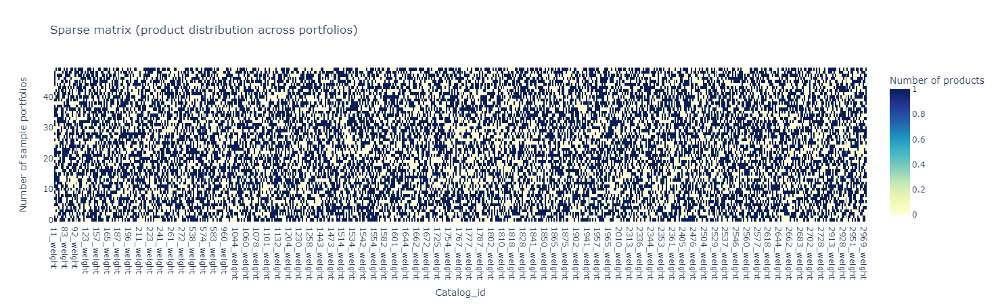
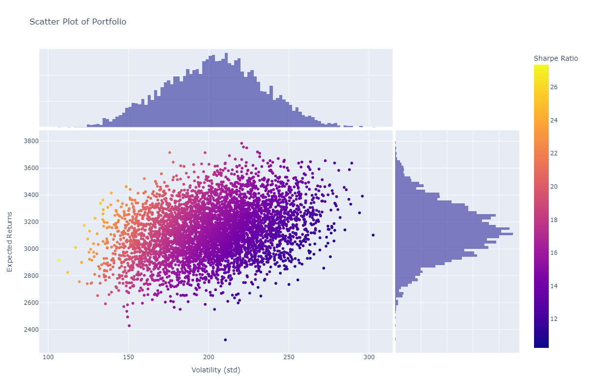
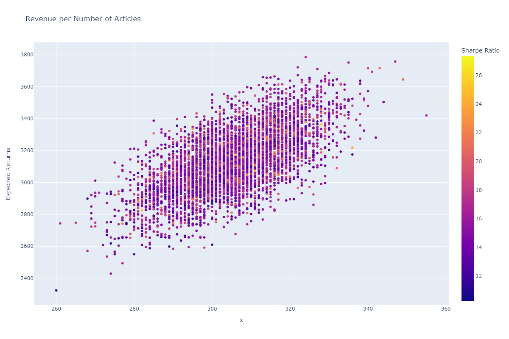
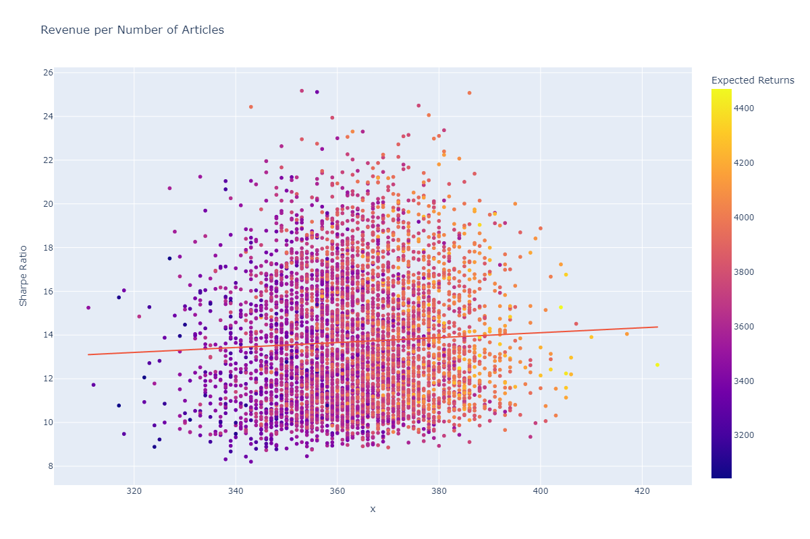
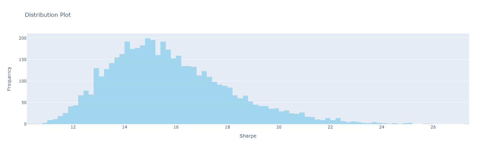
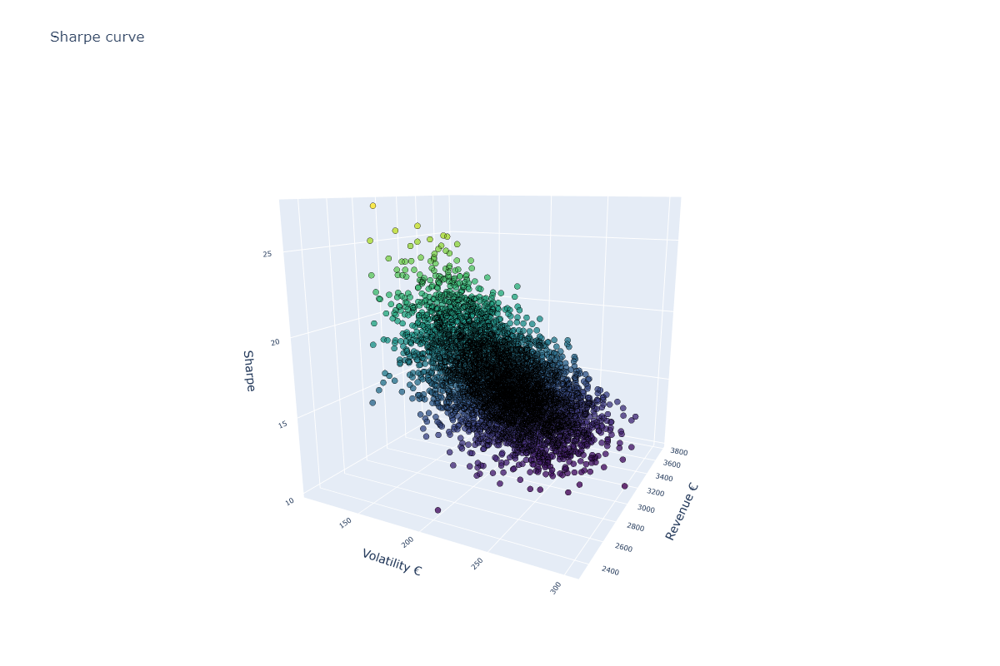
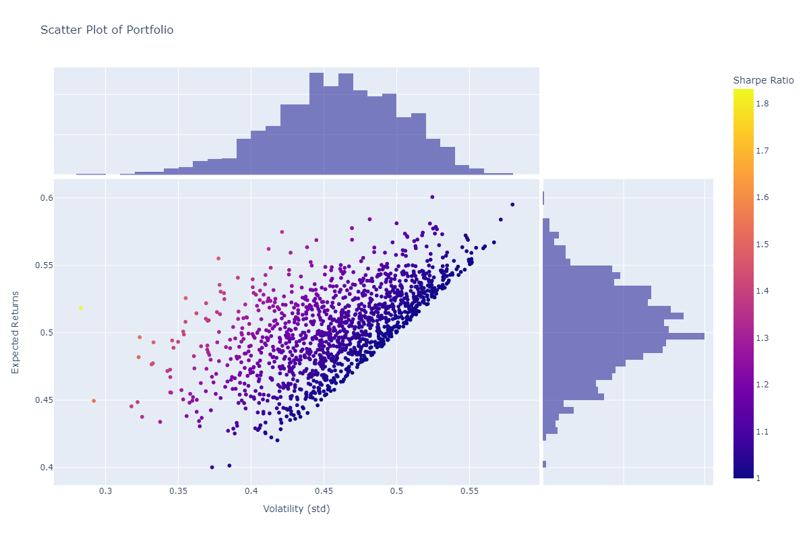

---
jupytext:
  formats: md:myst
  text_representation:
    extension: .md
    format_name: myst
    format_version: 0.13
    jupytext_version: 1.11.5
kernelspec:
  display_name: Python 3
  language: python
  name: python3
---

# 03: Product basket optimization approach using mean-variance optimization

In this notebook, we will introduce an approach of product basket optimization using the framework of financial assets management. This notebook will discuss:
- Introduction to mean-variance optimization and Modern Portfolio Theory (Markowitz)
- Relevance and statement of the problem
- Mathematical definition of M-V optimization and solution
- Analysis of benchmarking using naive portfolio and comparative performance
- Analysis of best portfolios and marginal contribution of individual product catalogs to the portfolio performance

**Keywords**: Portfolio Optimization, Random Portfolio Generation, Covariance Matrix, Expected Returns, Volatility, Diversification, Vinted

### Introduction to mean-variance optimization

Modern Portfolio Theory (MPT), introduced by Harry Markowitz in 1952, is a mathematical framework for constructing efficient investment portfolios. MPT is based on the idea that investors can construct portfolios that optimize expected return while minimizing risk.

The efficient frontier represents the set of portfolios that offer the highest expected return for a given level of risk, or the lowest risk for a given level of expected return.

### Key Assumptions

- **Defining expected return**: The expected return of a portfolio is the weighted average of the expected returns of its individual assets.

$E(R_p) = \sum_{i=1}^{n} w_i \cdot E(R_i)$

Where:
- $E(R_p)$ is the expected return of the portfolio.
- $w_i$ is the weight of asset \(i\) in the portfolio.
- $E(R_i)$ is the expected return of asset $i$.

- **Defining risk**: The proxy of risk in MPT is the variance of the portfolio.

- **Diversification**: One of the key principles of MPT is diversification, which involves spreading investments across different asset classes with uncorrelated or negatively correlated returns.

### Mathematical Formulation

The optimization problem in MPT can be formulated as a quadratic programming problem to find the optimal portfolio weights that maximize the expected return for a given level of risk or minimize the risk for a given level of expected return, subject to certain constraints such as budget constraints and minimum or maximum weight constraints.

$\text{Maximize} \quad E(R_p) = \mathbf{w}^T \mathbf{R}$

$
\text{Subject to:} \quad
\begin{cases}
\mathbf{w}^T \mathbf{1} = 1 & \text{(Budget constraint)} \\
\mathbf{w}^T \mathbf{\Sigma} \mathbf{w} \leq \sigma^2 & \text{(Risk constraint)} \\
w_i \geq 0 & \text{(Non-negativity constraint)}
\end{cases}
$

Where:
- $E(R_p)$ is the expected return of the portfolio.
- $\mathbf{w}$ is the vector of portfolio weights.
- $\mathbf{R}$ is the vector of expected returns of the assets.
- $\mathbf{\Sigma}$ is the covariance matrix of asset returns.
- $\sigma^2$ is the target risk level.

### The dataset

The dataset contains a lot of features (roughly more than 10) related with the product. For this analysis, we are considering only the price, date and catalog. The catalog is a hierarchical branch of products which share similar features.
For instance, men shoes is a catalog, but men sport shoes is another (child) catalog.

|   | price | catalog_id | date       |
|---|-------|------------|------------|
| 0 | 5     | 221        | 2024-01-28 |
| 1 | 30    | 560        | 2024-01-28 |
| 2 | 40    | 1242       | 2024-01-28 |
| 3 | 35    | 1467       | 2024-01-28 |
| 4 | 7     | 1801       | 2024-01-28 |


#### Some robustness in the data points

One way to reduce the inherent bias in the data is to pick catalogs having a minimum number of data points accross different dates. This can be done with a CTE (or subquery alternatively) and set the minimum number of days to **time_interval * 0.4**. In addition, we set the minimum count of products per date and catalog to a minimum number of samples **COUNT(product_id) > {n_samples}**.

```sql
WITH catalogs AS (
    SELECT catalog_id
    FROM public.tracking_staging
    WHERE date >= CURRENT_DATE - INTERVAL '{time_interval} days'
    GROUP BY catalog_id
    HAVING COUNT(DISTINCT date) > {time_interval * 0.4}          
)
SELECT PERCENTILE_CONT(0.5) WITHIN GROUP (ORDER BY price_numeric) as price, catalog_id, date -- need to replace for median
FROM public.tracking_staging 
WHERE date >= CURRENT_DATE - INTERVAL '{time_interval} days'
        AND catalog_id IN (SELECT catalog_id FROM catalogs)
GROUP BY date, catalog_id
HAVING COUNT(product_id) > {n_samples} ;

```

## Product Basket Optimization

The process of product basket optimization, for most companies is about **revenue maximization**. However, depending on the market, prices aren't always stable and sellers are price takers. This moreover describes the pricing dynamics of **second hand markets**. For this reason, the mean-returns variance optimization is a solid starting point.
In addition, having a sparse product portfolio diversifies portfolio risk. This implies different products serve different people, markets, necesseties and usages. Having a well rounded portfolio in termos of product attributes, categories and brands is smart business.

```python
def preprocess_data(data):
    data = data.pivot_table(index = "date", 
                            columns="catalog_id", 
                            values = "price")

    imputer = SimpleImputer(strategy='median')

    for col in data.columns:
        data[col] = imputer.fit_transform(data[col].values.reshape(-1, 1))

    return (data)
```

Let us consider a pivoted table of dates, catalogs and median of price as our input data. The first step is to fill missing values for the series using an imputing strategy. The strategy used here is 'median' value inputer because it's the least likely to alter statistical moments (distribution of the series). It's also worth noting, the pipeline is somewhat new so this preprocessing step can result in biased data.


### Generating Portfolios

We begin by constructing a covariance matrix using historical asset returns data. This matrix captures the pairwise relationships between assets and is crucial for modeling portfolio risk. Next, we define a generator function that iteratively generates random portfolios. Each portfolio is represented by a vector of asset weights, where each weight corresponds to the proportion of the portfolio invested in a particular asset. We randomly assign binary values (0 or 1) to these weights, representing whether an asset is included or excluded from the portfolio.

For each generated portfolio, we calculate its expected returns and volatility. Returns are computed as the dot product of the portfolio weights and the median returns of the assets. Volatility, representing portfolio risk, is estimated using the portfolio variance formula, which considers the covariance between assets.

```python

# generator function, creates an iterator over the number of portfolios we want to generate
# its a better practice, specially if num_port -> inf
def generate_random_portfolios(data, num_port, var_quantile):
    num_assets = len(data.columns)
    var_matrix = data.cov()

    for _ in range(num_port):
        # each asset has either value 0 or 1
        weights = np.random.randint(0, 2, size=num_assets)
        # the returns of the portfolio is the matrix multiplication between (weights,)*(,expected_returns)
        returns = np.dot(weights, data.median())
        # portfolio variance is the double sum of covariance between assets as in the formula
        var = var_matrix.mul(weights, axis=0).mul(weights, axis=1).sum().sum()
        std = np.sqrt(var)
        var_proxy = np.dot(weights, (data.median()-data.quantile(var_quantile)))

        yield weights, returns, std, var_proxy
```




```python
def compute_portfolio_stats(data, iterations, var_percentile):
    port_weights = []
    port_returns = []
    port_volatility = []
    port_var = []
    with st.spinner('Generating random portfolios...'):
        for weights, returns, volatility, var_proxy in generate_random_portfolios(data, iterations, var_percentile):
            port_weights.append(weights)
            port_returns.append(returns)
            port_volatility.append(volatility)
            port_var.append(var_proxy)

        new_data = {"Revenue": port_returns, 
                    "Volatility": port_volatility,
                    "VaR": port_var}

        for counter, symbol in enumerate(data.columns.tolist()):
            new_data[str(symbol)+'_weight'] = [w[counter] for w in port_weights]

    return(pd.DataFrame(new_data))
```

### Revenue-Volatility scatterplot

```python
fig = px.scatter(
    data_frame=portfolio,
    x='Volatility',
    y='Revenue',
    color='Sharpe',
    title='Scatter Plot of Portfolio',
    labels={'Volatility': 'Volatility (std)', 
            'Revenue': 'Expected Returns', 
            'Sharpe': 'Sharpe Ratio'},
    marginal_x='histogram',
    marginal_y='histogram', 
)

fig.update_layout(
    width=1200,  
    height=800,  
)
```



### Returns-Assets scatterplot

```python
fig = px.scatter(
    data_frame=portfolio,
    x=z,
    y='Revenue',
    color='Sharpe',
    title='Revenue per Number of Articles',
    labels={'Volatility': 'Volatility (std)', 
            'Revenue': 'Expected Returns', 
            'Sharpe': 'Sharpe Ratio'}
)

fig.update_layout(
    width=1200,
    height=800,
)
```






### Distribution plot of Sharpe

```python
histogram_trace = go.Histogram(
    x=portfolio['Sharpe'], 
    marker_color='skyblue',  
    opacity=0.7, 
)


layout = go.Layout(
    title='Distribution Plot',  
    xaxis=dict(title='Sharpe'), 
    yaxis=dict(title='Frequency'),  
)

fig = go.Figure(data=[histogram_trace], layout=layout)
```




### 3D scatterplot

```python
scatter3d_trace = go.Scatter3d(
    x=portfolio["Volatility"],
    y=portfolio["Revenue"],
    z=portfolio["Sharpe"],
    mode='markers',
    marker=dict(
        size=4,                    
        color=portfolio["Sharpe"],                   
        colorscale='Viridis',      
        opacity=0.8,
        line=dict(width=0.5, color='black') 
    )
)

layout = go.Layout(
    title='Sharpe curve',
    scene=dict(
        xaxis=dict(title='Volatility'),
        yaxis=dict(title='Revenue'),
        zaxis=dict(title='Sharpe')
    )
)

fig = go.Figure(data=[scatter3d_trace], layout=layout)

fig.update_layout(
    width=1200,  
    height=800,  
    scene=dict(
        xaxis=dict(title='Volatility €', tickfont=dict(size=10)),
        yaxis=dict(title='Revenue €', tickfont=dict(size=10)),
        zaxis=dict(title='Sharpe', tickfont=dict(size=10)),
        camera_eye=dict(x=1.2, y=1.2, z=1.2)
    ),
)
```



### Best portfolios

|      | Revenue | Volatility | Sharpe | Return |
|------|---------|------------|--------|--------|
| Top 1 | 137.0406 | 875 | 6.385 | 22.875 |
| Top 2 | 130.2423 | 1,065.25 | 8.179 | 28.125 |
| Top 3 | 129.8792 | 1,013.25 | 7.8015 | 25.125 |
| Top 4 | 127.7407 | 939.5 | 7.3547 | 19.625 |
| Top 5 | 122.9908 | 1,025.75 | 8.3401 | 20.25 |

## Benchmarking

### Naive portfolio

The naive approach in portfolio management, often referred to as the equal-weighted approach, is one of the simplest methods for constructing a portfolio. In this approach, an investor allocates an equal amount of capital to each asset in the portfolio, regardless of its individual characteristics or historical performance. Essentially, every asset receives the same weight or proportion of the total investment.


```python
weights = np.random.randint(1, 2, size=num_assets)
# the returns of the portfolio is the matrix multiplication 
# between (weights,)*(,expected_returns)
returns = np.dot(weights, data.median())
# portfolio variance is the double sum of covariance between assets as in the formula
var = var_matrix.mul(weights, axis=0).mul(weights, axis=1).sum().sum()
std = np.sqrt(var)
sharpe = returns/std
```

### Relative performance

```python
benchmark = pd.DataFrame()
benchmark["Revenue"] = portfolio["Revenue"]/returns
benchmark["Volatility"] = portfolio["Volatility"]/std
benchmark["Sharpe"] = portfolio["Sharpe"]/sharpe
```

```python
fig = px.scatter(
    data_frame=benchmark[benchmark["Sharpe"] > 1],
    x='Volatility',
    y='Revenue',
    color='Sharpe',
    title='Scatter Plot of Portfolio',
    labels={'Volatility': 'Volatility (std)', 
            'Revenue': 'Expected Returns', 
            'Sharpe': 'Sharpe Ratio'},
    marginal_x='histogram',
    marginal_y='histogram', 
)

fig.update_layout(
    width=1200,  
    height=800,  
)
```



|        | Revenue  | Volatility | Sharpe    |
|--------|----------|------------|-----------|
| count  | 5000.000 | 5000.000   | 5000.000  |
| mean   | 0.500249 | 0.546726   | 0.931803  |
| std    | 0.032070 | 0.078584   | 0.132446  |
| min    | 0.380148 | 0.282958   | 0.609597  |
| 25%    | 0.478904 | 0.492221   | 0.836924  |
| 50%    | 0.500042 | 0.545632   | 0.916325  |
| 75%    | 0.522273 | 0.600646   | 1.007526  |
| max    | 0.606488 | 0.844535   | 1.831502  |

### Which catalogs have the best Sharpe ratio

```python
from sklearn.linear_model import LinearRegression

reg = LinearRegression().fit(portfolio.drop(["Sharpe", "Revenue", "Volatility"], 
                            axis = 1), 
                            portfolio["Sharpe"])
coefficients = reg.coef_
top_5_indices = coefficients.argsort()[-5:][::-1]

# Get the corresponding labels
top_5_labels = portfolio.columns[top_5_indices]
for coef, label in zip(coefficients[top_5_indices], top_5_labels):
    print(f"{label}: {coef}")
```

| Asset     | Weight      |
|-----------|-------------|
| 2663      | 0.519356    |
| 2648      | 0.420556    |
| 2537      | 0.343053    |
| 2533      | 0.287713    |
| 1443      | 0.257313    |

This proves somewhat of a weak correlation between assets and sharpe ratio, which is understandable because a) each portfolio is a high dimensional sparse matrix and b) there are interaction terms which arent accounted for in the linear regression model.


### Conclusions

- The Sharpe ratio and the number of assets in the portfolio are not related
- The unique catalogs with greatest impact on asset are:
  - 2663: snow boots, 
  - 2648: indoor training shoes, 
  - 2537: quilted jackets, 
  - 2533: overcoats and long coats, 
  - 1443: hats
- The best portfolio is 180% better in comparison with naive portfolio


### Additional work

- Explore VaR
- Explore Portfolios without product limitations (maximum number of total products)
- Test several portfolios for different maximum number of total products