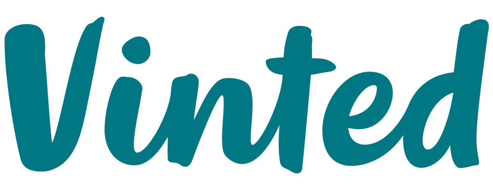
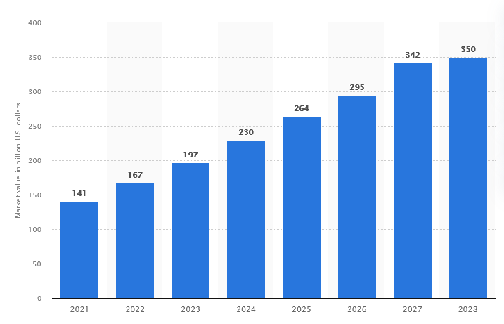
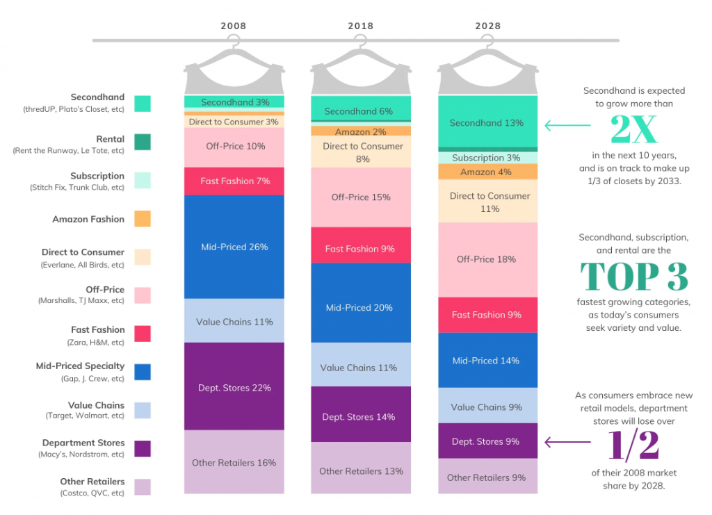

# Vinted - the rise of ESG marketplace

## Introduction to the Vinted Project

Vinted is a popular online marketplace that connects buyers and sellers of second-hand clothing, shoes, accessories, and other fashion items. It is a Lithuania-based online marketplace founded in 2008, specializing in second-hand clothing, shoes, accessories, and other fashion items. According to Statista, the global second-hand apparel market was valued at approximately \$200 billion in 2024 and is projected to reach \$350 billion by 2028, representing a compound annual growth rate (CAGR) of 15.5%.

**Vinted is one of Europe's hottest startups**.

> In 2021, Vinted raised \$303 million in Series F funding, valuing the company at over $4 billion and cementing its position as one of Europe's leading tech startups.

**Vinted is ESG friendly**

In addition, Vinted is a good alternative for growth investors seeking companies complying with Europe's ESG (environmental, social and corporate responsibilities).
> Vinted promotes sustainable fashion practices by extending the lifecycle of clothing and reducing the environmental impact of the fashion industry.

> According to Vinted's Sustainability Report, the platform helped save approximately 35,000 tons of CO2 emissions in 2020 through the sale of second-hand items.

Second hand clothing are on their way to dethrone mid and low tier clothing brands. Both cheap off price retailers and high end luxury should be safe. This marks a **new generation of customer behavior**.

> Millennials and Generation Z consumers, in particular, are driving the demand for sustainable fashion and are active participants on platforms like Vinted.

### Vinted as a seller
From a sellers perspective, the main focus points are:

- Easy listings process: Vinted provides a user-friendly platform where you can easily list your pre-owned clothing, shoes, accessories, and other fashion items for sale.
- Ability to reach a large audience: By selling on Vinted, you gain access to a large and diverse audience of potential buyers.
- Affordable selling fees
- Seller (and buyer) protection
- Direct communication with buyers
- Feedback and ratings system

## Project Scope

This project aims to leverage data from Vinted through scrapping in order to gain insights about sales volume, revenue, average selling price and trends over time.

The project is divided in 3 parts: **Data Engineering**, **Data Visualization** and **Data Modelling**.

