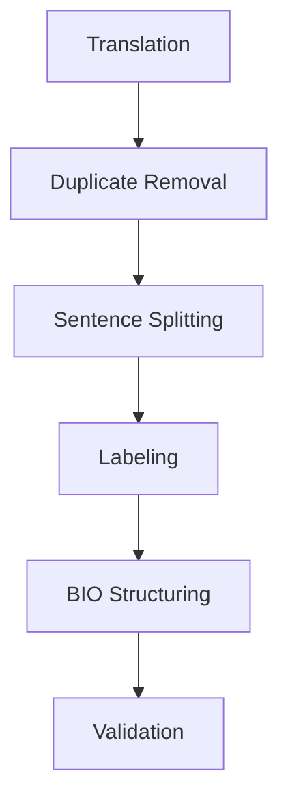
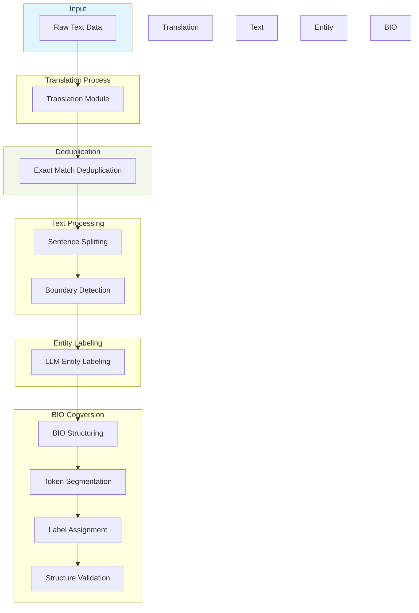

# Recreating Airbnb LAEP system in portuguese real estate agency listings

The LAEP system - Listing Attribute Extraction Platform is a machine learning system that extracts structured information from unstructured text data about Airbnb listings into structured taxonomy labels.
It consists of 3 main components:

1. Named Entity Recognition (NER)
- Identifies and classifies specific phrases (entities) into labels
- Detects 5 types of entities: Amenities, Facilities, Hospitality, Location Features and Structured details
- Uses a CNN framework to process tokenized text and identify entity spans
- Trained on 30k labeled examples from different text channels (House descriptions, Summary, Owner description, User reviews, Location description)

2. Entity Mapping (EM)
- Mapping maps the detected entities from NER to taxonomy classes in Airbnb classification system
- Handles variations of how people describe the same thing differently (lockbox = lock-box = lock box)
- Uses cosine similarity, returns label if Cosine Similarity > threshold
- Assigns confidence scores to mappings

3. Entity Scores
- Determines if mapped attributes actually exist in a listing
- Uses a fine tuned BERT model for text classification (next sentence prediction objective)
- Provides three possible outputs: YES (attribute present), NO (not present), or Unknown
- Analyzes local context (65 words around the detected phrase)
- Includes confidence scores for its determinations


# Named Entity Recognition

For this task we are using two different datasets:
- Airbnb open source datasets in kaggle, containing about 6 columns of listing details including description, space, summary, neightboorhood, transit and reviews description
- Imovirtual scraped rental descriptions


The workflow encompasses the following steps:
- Translate airbnb listing details to portuguese
- Pretrain our NER transformer with MLM + Multiclass objective in our airbnb dataset
- Employ a LLM as a NER labeler using few shot prompt
- Fine tuning our labeled dataset, using SVM classifier as novelty detection
- Generate BIO format datasets for entity recognition
- Train our pretrained NER BERT in our labeled dataset ('cross domain data')
- Evaluate the performance of the NER in our imovirtual descriptions

## 📊 Datasets Overview

### Airbnb Dataset
*Open source dataset from Kaggle*

- Airbnb open source datasets in kaggle, containing about 6 columns of listing details including description, space, summary, neightboorhood, transit and reviews description.


**Key Statistics:**
- Rows: `20,000`
- Total Words: `20M+`
- Average Length: `1,000 words/entry`

**Columns:**
- Description
- Space
- Summary
- Neighborhood
- Transit
- Reviews Description

### Imovirtual Dataset 
*Scraped rental descriptions*

**Key Statistics:**
- Rows: `8,000`
- Total Words: `4M+`
- Average Length: `600 words/entry`

**Content:**
Collection of descriptions, prices, and property characteristics from all available rentals to date.


### Preprocessing pipeline and transfer-learning



### Implementation details
**Translation:**
* Using Google Translate API
* Focuses on maintaining semantic accuracy

**Labeling:**
* Powered by Gemini 2.0 flash
* Implements few-shot learning approach

<div class="alert alert-warning" role="alert" style="background-color: #fff3cd; border: 1px solid #ffeeba; border-radius: 4px; padding: 1rem; margin: 1rem 0;">
    <h4 style="color: #856404; margin-top: 0;">⚠️ Known Issues</h4>
    <ul style="margin-bottom: 0; padding-left: 20px;">
        <li><strong>Translation:</strong> Quality maintenance challenges during translation, cultural accuracy issues between colloquial Portuguese and translated Portuguese/Brazilian</li>
        <li><strong>Duplicate removal:</strong> Needs fuzzy logic implementation for near-duplicate detection</li>
        <li><strong>Sentence splitting:</strong> Context loss due to simple end-character detection, needs i-1 and i+1 sentence consideration</li>
        <li><strong>Labeling:</strong> Potential low-quality datasets from LLM labelers</li>
    </ul>
</div>



### Resulting dataset

| Metric | Value |
|--------|--------|
| Total Entities | 10941 |
| Unique Entities | 5176 |
| Unique Labels | 5 |
| Average Entity Length | 15.03 |
| Most Common Label | Facility |
| Most Common Entity | apartamento |

### Label Statistics

| Label | Count | Percentage | Unique Entities | Avg Length |
|-------|--------|------------|-----------------|------------|
| Amenity | 376 | 3.44 | 221 | 15.02 |
| Appliances | 1319 | 12.06 | 498 | 13.46 |
| Facility | 4203 | 38.42 | 1551 | 13.61 |
| Hospitality | 2236 | 20.44 | 1349 | 15.39 |
| Location Features | 2807 | 25.66 | 1714 | 17.59 |

### Top 20 Most Common Entities

| Entity | Count | Label |
|--------|--------|--------|
| apartamento | 198 | Facility |
| banheiro | 190 | Facility |
| cozinha | 187 | Facility |
| sala de estar | 172 | Facility |
| quarto | 166 | Facility |
| chuveiro | 84 | Facility |
| Amsterdã | 82 | Location Features |
| cama de casal | 78 | Hospitality |
| varanda | 74 | Facility |
| banheira | 70 | Facility |
| forno | 66 | Appliances |
| micro-ondas | 62 | Appliances |
| restaurantes | 58 | Location Features |
| jardim | 56 | Amenity |
| máquina de lavar | 54 | Appliances |
| geladeira | 53 | Appliances |
| máquina de lavar louça | 53 | Appliances |
| centro da cidade | 48 | Location Features |
| lava-louças | 44 | Appliances |
| quarto principal | 43 | Facility |
| Vondelpark | 42 | Location Features |
| vaso sanitário | 42 | Facility |
| primeiro andar | 42 | Facility |
| Wi-Fi | 41 | Amenity |

### LLM annotations

```
- A beleza do apartamento é que depois de um dia maravilhoso na vibrante e movimentada [Amsterdã](Location Features), você volta para casa depois de uma curta caminhada ou uma [viagem de ônibus/bonde](Location Features) neste adorável apartamento tranquilo. Assista a um filme na [Netflix] (Appliances), beba um vinho na [varanda] (Facility) ou vá direto para a [cama] (Hospitality) em um de nossos dois [aconchegantes quartos] (Facility).
```

### Validation

**Original**: - A beleza do apartamento é que depois de um dia maravilhoso na vibrante e movimentada [Amsterdã](Location Features), você volta para casa depois de uma curta caminhada ou uma [viagem de ônibus/bonde](Location Features) neste adorável apartamento tranquilo. Assista a um filme na [Netflix] (Appliances), beba um vinho na [varanda] (Facility) ou vá direto para a [cama] (Hospitality) em um de nossos dois [aconchegantes quartos] (Facility).


**Cleaned**: - A beleza do apartamento é que depois de um dia maravilhoso na vibrante e movimentada Amsterdã, você volta para casa depois de uma curta caminhada ou uma viagem de ônibus/bonde neste adorável apartamento tranquilo. Assista a um filme na Netflix, beba um vinho na varanda ou vá direto para a cama em um de nossos dois aconchegantes quartos.

Entities:
- Entity: Amsterdã
  Label: Location Features
  Position 87:95: 'Amsterdã' ✓
- Entity: viagem de ônibus/bonde
  Label: Location Features
  Position 155:177: 'viagem de ônibus/bonde' ✓
- Entity: Netflix
  Label: Appliances
  Position 238:245: 'Netflix' ✓
- Entity: varanda
  Label: Facility
  Position 264:271: 'varanda' ✓
- Entity: cama
  Label: Hospitality
  Position 292:296: 'cama' ✓
- Entity: aconchegantes quartos
  Label: Facility
  Position 318:339: 'aconchegantes quartos' ✓

### Structured output (Before BIO conversion)

```json
{
"text": "Compartilharemos a [sala de estar](Facility), [cozinha](Facility), [banheiro](Facility) e [banheiro](Facility)",
"entities": [
    {
    "start": 20,
    "end": 33,
    "label": "Facility",
    "text": "sala de estar"
    },
    {
    "start": 47,
    "end": 54,
    "label": "Facility",
    "text": "cozinha"
    },
    {
    "start": 68,
    "end": 76,
    "label": "Facility",
    "text": "banheiro"
    },
    {
    "start": 91,
    "end": 99,
    "label": "Facility",
    "text": "banheiro"
    }
]
}
```


## Pretrain BERT with MLM + Multiclass objective on language corpus

### Don’t Stop Pretraining

This aligns with findings from the paper "Don’t Stop Pretraining", which emphasizes that adapting language models to domains improves downstream task performance by up to 30% [https://www.sbert.net/examples/unsupervised_learning/MLM/README.html]. For Airbnb, a model pretrained on property descriptions, reviews, and booking data would better capture terms like "amenities," "host policies," or regional lodging trends compared to generic text.
- Improves performance on tasks on that domain and across domains
- Increases the available dataset for training tasks and generalization

[insert reasoning on why we added multiclass objective leveraging the existent airbnb classification system]

### Learning general language features and tasks specific features

The addition of a multiclass objective—using Airbnb’s classification system (e.g., property types, pricing tiers, labels)—serves two purposes:
- **Task Specific Adapatation**: we are leveraging the pretraining phase to tune on labeled data, which might further enhance pretraining
- **Data Efficiency**: reduce downstream fine tuning costs (model already encodes task relevant features at pretraining).

[explain how multiclass objective might help with gradient flow]
### Gradient flow

Mixing unsupervised learning (MLM) and supervised learning (multiclassification) adds different learning signals which may improve gradient flow by injecting gradient diversity and model robustness, reducing the likelihood model stays stuck at local minima and acting as a regularization as well.


This mirrors BERT original training where MLM and Next Sentene Prediction (NSP) are jointly used [https://discuss.huggingface.co/t/how-to-train-bert-from-scratch-on-a-new-domain-for-both-mlm-and-nsp/3115]. The principle of multtask-driven gradient flow improvement is well estabilished during transformer pretraining.

### Possible issues

- The cross domain dataset used for pretrained might not be representative of our original dataset
- Multiobjective learning functions add a bigger computational costs
- Multiclass head adds additional overhead
- MLM with multiobjective might compete and not converge if labels are noisy or misaligned
    - Implemented a *beta* factor for multiclass objective


### Results

| Before pretraining | After pretraining |
|:------------------:|:-----------------:|
|  |  |

#### Embeddings Space quality validation

<table>
  <tr>
    <td width="70%"></td>
    <td width="30%" style="font-size: 0.65em; vertical-align: top; padding: 0;">
      <table style="font-size: 0.65em; border-collapse: collapse; width: 100%;">
        <tr style="line-height: 1.1;"><th style="padding: 1px;">Class</th><th style="padding: 1px;">Precision</th><th style="padding: 1px;">Recall</th><th style="padding: 1px;">F1 Score</th><th style="padding: 1px;">Support</th></tr>
        <tr style="line-height: 1.1;"><td style="padding: 1px;">Amenity</td><td style="padding: 1px;">0.00</td><td style="padding: 1px;">0.00</td><td style="padding: 1px;">0.00</td><td style="padding: 1px;">221</td></tr>
        <tr style="line-height: 1.1;"><td style="padding: 1px;">Appliances</td><td style="padding: 1px;">0.79</td><td style="padding: 1px;">0.69</td><td style="padding: 1px;">0.74</td><td style="padding: 1px;">498</td></tr>
        <tr style="line-height: 1.1;"><td style="padding: 1px;">Facility</td><td style="padding: 1px;">0.79</td><td style="padding: 1px;">0.83</td><td style="padding: 1px;">0.81</td><td style="padding: 1px;">1551</td></tr>
        <tr style="line-height: 1.1;"><td style="padding: 1px;">Hospital</td><td style="padding: 1px;">0.74</td><td style="padding: 1px;">0.77</td><td style="padding: 1px;">0.75</td><td style="padding: 1px;">1349</td></tr>
        <tr style="line-height: 1.1;"><td style="padding: 1px;">Location</td><td style="padding: 1px;">0.83</td><td style="padding: 1px;">0.89</td><td style="padding: 1px;">0.86</td><td style="padding: 1px;">1714</td></tr>
        <tr style="line-height: 0.5;"><td colspan="5" style="padding: 0px;"></td></tr>
        <tr style="line-height: 1.1;"><td style="padding: 1px;">Accuracy</td><td colspan="2" style="padding: 1px;"></td><td style="padding: 1px;">0.79</td><td style="padding: 1px;">5333</td></tr>
        <tr style="line-height: 1.1;"><td style="padding: 1px;">Macro</td><td style="padding: 1px;">0.63</td><td style="padding: 1px;">0.64</td><td style="padding: 1px;">0.63</td><td style="padding: 1px;">5333</td></tr>
        <tr style="line-height: 1.1;"><td style="padding: 1px;">Weighted</td><td style="padding: 1px;">0.76</td><td style="padding: 1px;">0.79</td><td style="padding: 1px;">0.77</td><td style="padding: 1px;">5333</td></tr>
      </table>
    </td>
  </tr>
</table>


The pretrained encoder should create semantically meaningful embeddings. These embeddings should show clearn clusters by entity types and a classification algorithm such as SVM decision boundaries should be able to help validate these clusters semantic sense.

Outliers might indicate data quality issues:
- mislabled entities in training data
- unusual but valid entities which are feature rich
- noise that should be cleaned

Data quality improvement actions:
- Review entity's label accuracy
- Identify systematic labeling errors
- Remove or relabel incorrect instances

<div style="padding: 1.2em; margin: 1.2em 0; border-left: 6px solid #4B56D2; background-color: #EEF1FF; border-radius: 0.3em; box-shadow: 0 2px 4px rgba(0,0,0,0.05);">
  <p style="font-weight: bold; font-size: 1.3em; margin-top: 0; margin-bottom: 0.8em; color: #4B56D2; border-bottom: 1px solid rgba(75,86,210,0.2); padding-bottom: 0.4em;">Analysis</p>
  <p style="margin: 0.6em 0; line-height: 1.5; font-size: 1.05em;">We can conclude the entities are generally well learnt and with show meaningful representation. Its possible to see clear outliers, that is, entities which are assigned to the wrong label; its possible to see the boundary entities and where each label is semantically connected to other label. However, an important note is the <span style="font-style: italic; background-color: rgba(75,86,210,0.1); padding: 0 3px;">Amenity</span> type label, which is an obvious stand out because it has a sparse representations and its features we're not learnt by the model.
  Possible cause include: undersampling and under-represented, with only less than 300 samples; its semantic definition is not well defined and overlaps with other labels.</p>
  <p style="margin: 0.8em 0; font-size: 1.1em;"><strong style="color: #333;">Key observations:</strong></p>
  <ul style="margin: 0.6em 0 0.8em 1.5em; line-height: 1.6;">
    <li>Labels show a very clear definition in the embeddings space</li>
    <li>Model captured semantic rich patterns and relevant context information</li>
    <li>Amenity label has no semantical definition and overlaps with other labels, which will be harmful during fine tuning (NER)</li>
  </ul>
  <p style="margin: 0.8em 0; line-height: 1.5; font-size: 1.05em; border-top: 1px solid rgba(75,86,210,0.2); padding-top: 0.6em;">Further investigation into the semantic similarity between frequently confused entities may help improve model performance.</p>
</div>

## Finetuning

Training loss looks good, with no signs of overfitting. However, it's obvious it underfits (the loss is still a bit too high after learning). This is very likely due to mislabeled entities and Amenity label. **F1 Score: 0.8542**

| Training/Validation Loss | Semantic learning Animation |
|:---:|:---:|
|  |  |

### Label metrics

| Label Metrics | Confusion Matrix |
|:---:|:---:|
|  |  |

# How well does the model knowledge transfer to our target data?

| Top 20 entities by label | Total entities per label |
|:---:|:---:|
|  |  |

<table>
<tr>
<td></td>
<td></td>
</tr>
<tr>
<td style="text-align: center;">Cross-domain dataset (train)</td>
<td style="text-align: center;">Imovirtual listings (test)</td>
</tr>
</table>


<div style="padding: 1.2em; margin: 1.2em 0; border-left: 6px solid #D14B4B; background-color: #FFEFEF; border-radius: 0.3em; box-shadow: 0 2px 4px rgba(0,0,0,0.05);"> <p style="font-weight: bold; font-size: 1.3em; margin-top: 0; margin-bottom: 0.8em; color: #D14B4B; border-bottom: 1px solid rgba(209,75,75,0.2); padding-bottom: 0.4em;">Conclusions</p> <p style="margin: 0.6em 0; line-height: 1.5; font-size: 1.05em;">The target dataset outperforms the translated training dataset in terms of embedding quality and class separation. Clear patterns and semantic alignment indicate a stronger signal-to-noise ratio in the target data.</p> <p style="margin: 0.6em 0; line-height: 1.5; font-size: 1.05em;"><strong style="color: #333;">Translation Losses:</strong> Translated data introduces noise through <span style="font-style: italic; background-color: rgba(209,75,75,0.1); padding: 0 3px;">context loss</span>, <span style="font-style: italic; background-color: rgba(209,75,75,0.1); padding: 0 3px;">idiomatic inaccuracies</span>, and <span style="font-style: italic; background-color: rgba(209,75,75,0.1); padding: 0 3px;">ambiguities</span>, which blur feature distinctions and harm learning.</p> <p style="margin: 0.6em 0; line-height: 1.5; font-size: 1.05em;"><strong style="color: #333;">Ambiguous Expressions:</strong> Less unique entities in the target database ultimately helps. While algorithms might chose different synonyms for the same words, native speakers are usually very keen on using the same expressions.</p> <p style="margin: 0.8em 0; font-size: 1.1em;"><strong style="color: #333;">Key Observations:</strong></p> <ul style="margin: 0.6em 0 0.8em 1.5em; line-height: 1.6;"> <li>Target embeddings exhibit clearer class definitions and reduced ambiguity.</li> <li>Native Portuguese expressions enhance context relevance and discriminative power.</li> <li>Translated data introduces noise that hampers embedding clarity and model training.</li> </ul> <p style="margin: 0.8em 0; line-height: 1.5; font-size: 1.05em; border-top: 1px solid rgba(209,75,75,0.2); padding-top: 0.6em;">Translation here acts as a data augmentar and regularization mechanisms as it introduces variability and noise to the data.</p> </div>

# Future work

- Improve deduplication algorithm for near duplicates
- Improve translation algorithm to preserve language and semantics
- Reassess label classes definition to avoid overlaps, specially on 'Amenity'
- Remove or relabel incorrect entities
- Apply this data mining model to imovirtual joining with the tabular data from the listing to get meaningful data. 
