#  Wisdom of unstructured data
> Recreating Airbnb LAEP system in portuguese real estate agency listings

The LAEP system - Listing Attribute Extraction Platform is a machine learning system that extracts structured information from unstructured text data about Airbnb listings into structured taxonomy labels (reference https://medium.com/airbnb-engineering/wisdom-of-unstructured-data-building-airbnbs-listing-knowledge-from-big-text-data-7c533466a63c).

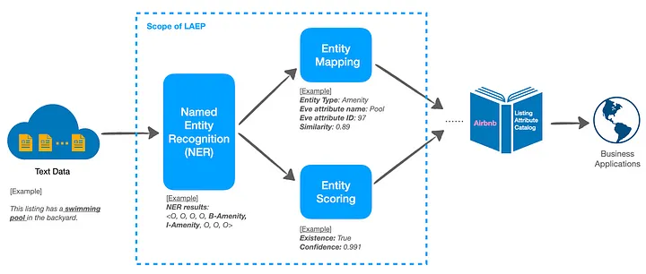


It consists of 3 main components:

<table style="width:100%; border-collapse: collapse;">
  <thead>
    <tr>
      <th style="width:33%; padding:10px; border: 1px solid #ddd; text-align:left; vertical-align:top; background-color:#f9f9f9;">
        <h4>1. Named Entity Recognition (NER)</h4>
      </th>
      <th style="width:33%; padding:10px; border: 1px solid #ddd; text-align:left; vertical-align:top; background-color:#f9f9f9;">
        <h4>2. Entity Mapping (EM)</h4>
      </th>
      <th style="width:33%; padding:10px; border: 1px solid #ddd; text-align:left; vertical-align:top; background-color:#f9f9f9;">
        <h4>3. Entity Scores</h4>
      </th>
    </tr>
  </thead>
  <tbody>
    <tr>
      <td style="padding:10px; border: 1px solid #ddd; vertical-align:top;">
        <ul style="margin-top:0; padding-left: 20px;">
          <li><strong>Function:</strong> Identifies & classifies phrases (entities) into labels.</li>
          <li><strong>Detects:</strong> 5 entity types (Amenities, Facilities, Hospitality, Location Features, Structured details).</li>
          <li><strong>Method:</strong> CNN framework processes tokenized text to find entity spans.</li>
          <li><strong>Training:</strong> 30k labeled examples (from House descriptions, Summaries, Owner notes, Reviews, Location info).</li>
        </ul>
      </td>
      <td style="padding:10px; border: 1px solid #ddd; vertical-align:top;">
        <ul style="margin-top:0; padding-left: 20px;">
          <li><strong>Function:</strong> Maps detected NER entities to Airbnb taxonomy classes.</li>
          <li><strong>Handles:</strong> Variations in descriptions (e.g., <em>lockbox = lock-box = lock box</em>).</li>
          <li><strong>Method:</strong> Cosine Similarity; returns label if score > threshold.</li>
          <li><strong>Output:</strong> Mapped entities with confidence scores.</li>
        </ul>
      </td>
      <td style="padding:10px; border: 1px solid #ddd; vertical-align:top;">
        <ul style="margin-top:0; padding-left: 20px;">
          <li><strong>Function:</strong> Determines if mapped attributes actually exist in a listing.</li>
          <li><strong>Method:</strong> Fine-tuned BERT model (Next Sentence Prediction objective).</li>
          <li><strong>Context:</strong> Analyzes local context (65 words around detected phrase).</li>
          <li><strong>Output:</strong> YES (present), NO (not present), or UNKNOWN, with confidence scores.</li>
        </ul>
      </td>
    </tr>
  </tbody>
</table>


# Named Entity Recognition

For this task we are using two different datasets:
- Airbnb open source datasets in kaggle, containing about 6 columns of listing details including description, space, summary, neightboorhood, transit and reviews description
- Imovirtual scraped rental descriptions


The workflow encompasses the following steps:
<table style="width:100%; border:none;">
  <tr>
    <td style="width:48%; vertical-align:top; padding-right:2%;">
      <h4 style="margin-top:0; margin-bottom:8px;">Pretrain (AirBnB dataset)</h4>
      <ol style="margin-top:0; margin-bottom:0; padding-left:25px; list-style-position: outside;">
        <li style="margin-bottom:4px;">Concat columns [<code>"name"</code>, <code>"summary"</code>, <code>"space"</code>, <code>"neighborhood_overview"</code>, <code>"interaction"</code>, <code>"house_rules"</code>]</li>
        <li style="margin-bottom:4px;"><strong>Translate airbnb listings</strong> details to portuguese</li>
        <li style="margin-bottom:4px;">Split into <strong>2048 token chunks</strong></li>
        <li style="margin-bottom:4px;">Get the most frequent <strong>amenities</strong> as one-hot labels</li>
        <li style="margin-bottom:0;"><strong>Pretrain</strong> our NER transformer with MLM + Multiclass objective with amenities</li>
      </ol>
    </td>
    <td style="width:48%; vertical-align:top; padding-left:2%;">
      <h4 style="margin-top:0; margin-bottom:8px;">Fine tune (imovirtual dataset)</h4>
      <ol style="margin-top:0; margin-bottom:0; padding-left:25px; list-style-position: outside;">
        <li style="margin-bottom:4px;">Mine the imovirtual listings descriptions</li>
        <li style="margin-bottom:4px;">Employ a foundational model as a <strong>NER labeler</strong> using few shot prompt</li>
        <li style="margin-bottom:4px;"><strong>Refine and preprocess our labeled dataset</strong>, using SVM classifier as novelty detection</li>
        <li style="margin-bottom:4px;"><strong>Generate BIO format</strong> datasets for entity recognition</li>
        <li style="margin-bottom:4px;"><strong>Fine tune our pretrained BERT</strong> in our labeled dataset ('cross domain data') with NER (classification objective)</li>
        <li style="margin-bottom:0;"><strong>Evaluate the performance</strong> of the NER in our imovirtual descriptions</li>
      </ol>
    </td>
  </tr>
</table>

## 📊 Datasets Overview

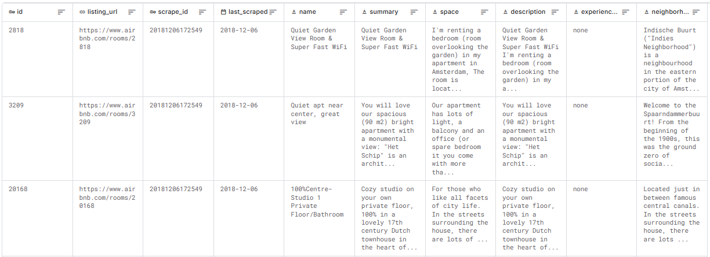

<table style="width:100%; border:none;">
  <tr>
    <td style="width:48%; vertical-align:top; padding-right:2%;">
      <h3 style="margin-top:0; margin-bottom:5px;">Airbnb Dataset (training dataset)</h3>
      <p style="margin-top:0; margin-bottom:8px; font-size:0.9em;"><em>Open source dataset from Kaggle</em></p>
      <p style="margin-top:0; margin-bottom:8px;">Airbnb open source datasets in Kaggle, containing about 6 columns of listing details including description, space, summary, neightboorhood, transit and reviews description.</p>

  <strong style="display:block; margin-bottom:3px;">Key Statistics:</strong>
  <ul style="margin-top:0; margin-bottom:8px; padding-left:20px; list-style-position: outside;">
    <li style="margin-bottom:2px;">Rows: <code>20,000</code></li>
    <li style="margin-bottom:2px;">Total Words: <code>20M+</code></li>
    <li style="margin-bottom:0;">Average Length: <code>1,000 words/entry</code></li>
    </ul>

  <strong style="display:block; margin-bottom:3px;">Columns:</strong>
    <ul style="margin-top:0; margin-bottom:0; padding-left:20px; list-style-position: outside;">
    <li style="margin-bottom:2px;">Description</li>
    <li style="margin-bottom:2px;">Space</li>
    <li style="margin-bottom:2px;">Summary</li>
      <li style="margin-bottom:2px;">Neighborhood</li>
      <li style="margin-bottom:2px;">Transit</li>
      <li style="margin-bottom:0;">Reviews Description</li>
    </ul>
  </td>
  <td style="width:48%; vertical-align:top; padding-left:2%;">
    <h3 style="margin-top:0; margin-bottom:5px;">Imovirtual Dataset (fine tune dataset)</h3>
    <p style="margin-top:0; margin-bottom:8px; font-size:0.9em;"><em>Scraped rental descriptions</em></p>

  <strong style="display:block; margin-bottom:3px;">Key Statistics:</strong>
    <ul style="margin-top:0; margin-bottom:8px; padding-left:20px; list-style-position: outside;">
      <li style="margin-bottom:2px;">Rows: <code>8,000</code></li>
      <li style="margin-bottom:2px;">Total Words: <code>4M+</code></li>
      <li style="margin-bottom:0;">Average Length: <code>600 words/entry</code></li>
    </ul>

  <strong style="display:block; margin-bottom:3px;">Content:</strong>
    <p style="margin-top:0; margin-bottom:0;">Collection of descriptions, prices, and property characteristics from all available rentals to date.</p>
  </td>
  </tr>
</table>

# Part I - Pretraining

### Preprocessing pipeline and transfer-learning

```{mermaid}
graph TD
    A[Translation] --> B[Duplicate Removal]
    B --> C[Sentence Splitting]
    C --> D[Labeling]
    D --> E[BIO Structuring]
    E --> F[Validation]
```

### Implementation details
**Translation:**
* Using Google Translate API
* Focuses on maintaining semantic accuracy

**Labeling:**
* Powered by Gemini 2.0 flash
* Implements few-shot learning approach

<div class="alert alert-warning" role="alert" style="background-color: #fff3cd; border: 1px solid #ffeeba; border-radius: 4px; padding: 1rem; margin: 1rem 0;">
    <h4 style="color: #856404; margin-top: 0;">⚠️ Known Issues</h4>
    <ul style="margin-bottom: 0; padding-left: 20px;">
        <li><strong>Translation:</strong> Quality maintenance challenges during translation, cultural accuracy issues between colloquial Portuguese and translated Portuguese/Brazilian</li>
        <li><strong>Duplicate removal:</strong> Needs fuzzy logic implementation for near-duplicate detection</li>
        <li><strong>Sentence splitting:</strong> Context loss due to simple end-character detection, needs i-1 and i+1 sentence consideration</li>
        <li><strong>Labeling:</strong> Potential low-quality datasets from LLM labelers</li>
    </ul>
</div>


## Pretrain BERT with MLM + Multiclass objective on language corpus

### Don’t Stop Pretraining

This aligns with findings from the paper "Don’t Stop Pretraining", which emphasizes that adapting language models to domains improves downstream task performance by up to 30% [https://www.sbert.net/examples/unsupervised_learning/MLM/README.html]. For Airbnb, a model pretrained on property descriptions, reviews, and booking data would better capture terms like "amenities," "host policies," or regional lodging trends compared to generic text.
- Improves performance on tasks on that domain and across domains
- Increases the available dataset for training tasks and generalization

$$
\mathcal{L}_{\text{total}} = \mathcal{L}_{\text{MLM}} + \beta \cdot \mathcal{L}_{\text{MC}}
$$

**In summary, the overall objective is:**

$$
\mathcal{L}_{\text{total}}(\theta) = - \sum_{i \in \text{masked\_tokens}} \log P(w_i | \text{context}_i; \theta) - \beta \sum_{j \in \text{sequences}} \sum_{c \in \text{classes}} y_{j,c} \log P(\text{class}_c | \text{sequence}_j; \theta)
$$

It maximizes the likelihood of predicting masked tokens based on the conditional support of unmasked tokens (MLM) and predicting the amenity class given the full context.

#### Learning general language features and tasks specific features

The addition of a multiclass objective—using Airbnb’s classification system (e.g., property types, pricing tiers, labels)—serves two purposes:
- **Task Specific Adapatation**: we are leveraging the pretraining phase to tune on labeled data, which might further enhance pretraining
- **Data Efficiency**: reduce downstream fine tuning costs (model already encodes task relevant features at pretraining).

#### Gradient flow

Mixing unsupervised learning (MLM) and supervised learning (multiclassification) adds different learning signals which may improve gradient flow by injecting gradient diversity and model robustness, reducing the likelihood model stays stuck at local minima and acting as a regularization as well.

This mirrors BERT original training where MLM and Next Sentene Prediction (NSP) are jointly used [https://discuss.huggingface.co/t/how-to-train-bert-from-scratch-on-a-new-domain-for-both-mlm-and-nsp/3115]. The principle of multtask-driven gradient flow improvement is well estabilished during transformer pretraining.

#### Possible issues

- The cross domain dataset used for pretrained might not be representative of our original dataset
- Multiobjective learning functions add a bigger computational costs
- Multiclass head adds additional overhead
- MLM with multiobjective might compete and not converge if labels are noisy or misaligned
    - Implemented a *beta* factor for multiclass objective

# Part II - Finetuning

```{mermaid}
flowchart TD
    subgraph Input
        A[Raw Text Data]
    end

    subgraph Translation Process
        B[Translation Module]
    end

    subgraph Deduplication
        C[Exact Match Deduplication]
    end

    subgraph Text Processing
        D[Sentence Splitting]
        D1[Boundary Detection]
    end

    subgraph Entity Labeling
        E[LLM Entity Labeling]
    end

    subgraph BIO Conversion
        F[BIO Structuring]
        F1[Token Segmentation]
        F2[Label Assignment]
        F3[Structure Validation]
        F --> F1 --> F2 --> F3
    end

    A --> B
    B --> C
    C --> D
    D --> D1
    D1 --> E
    E --> F
    
    style Input fill:#e1f5fe
    style Translation Process fill:#fff3e0
    style Deduplication fill:#f1f8e9
    style Text Processing fill:#f3e5f5
    style Entity Labeling fill:#fff3e0
    style BIO Conversion fill:#e8eaf6
```

<table style="width:100%; border:none;">
  <tr>
    <td style="width:48%; vertical-align:top; padding-right:2%;">
      <h3>Resulting dataset</h3>
      <table style="width:100%; border-collapse: collapse;">
        <thead>
          <tr>
            <th style="border: 1px solid #ddd; padding: 8px; text-align: left;">Metric</th>
            <th style="border: 1px solid #ddd; padding: 8px; text-align: left;">Value</th>
          </tr>
        </thead>
        <tbody>
          <tr>
            <td style="border: 1px solid #ddd; padding: 8px;">Total Entities</td>
            <td style="border: 1px solid #ddd; padding: 8px;">10941</td>
          </tr>
          <tr>
            <td style="border: 1px solid #ddd; padding: 8px;">Unique Entities</td>
            <td style="border: 1px solid #ddd; padding: 8px;">5176</td>
          </tr>
          <tr>
            <td style="border: 1px solid #ddd; padding: 8px;">Unique Labels</td>
            <td style="border: 1px solid #ddd; padding: 8px;">5</td>
          </tr>
          <tr>
            <td style="border: 1px solid #ddd; padding: 8px;">Average Entity Length</td>
            <td style="border: 1px solid #ddd; padding: 8px;">15.03</td>
          </tr>
          <tr>
            <td style="border: 1px solid #ddd; padding: 8px;">Most Common Label</td>
            <td style="border: 1px solid #ddd; padding: 8px;">Facility</td>
          </tr>
          <tr>
            <td style="border: 1px solid #ddd; padding: 8px;">Most Common Entity</td>
            <td style="border: 1px solid #ddd; padding: 8px;">apartamento</td>
          </tr>
        </tbody>
      </table>
    </td>
    <td style="width:48%; vertical-align:top; padding-left:2%;">
      <h3>Label Statistics</h3>
      <table style="width:100%; border-collapse: collapse;">
        <thead>
          <tr>
            <th style="border: 1px solid #ddd; padding: 8px; text-align: left;">Label</th>
            <th style="border: 1px solid #ddd; padding: 8px; text-align: left;">Count</th>
            <th style="border: 1px solid #ddd; padding: 8px; text-align: left;">Percentage</th>
            <th style="border: 1px solid #ddd; padding: 8px; text-align: left;">Unique Entities</th>
            <th style="border: 1px solid #ddd; padding: 8px; text-align: left;">Avg Length</th>
          </tr>
        </thead>
        <tbody>
          <tr>
            <td style="border: 1px solid #ddd; padding: 8px;">Amenity</td>
            <td style="border: 1px solid #ddd; padding: 8px;">376</td>
            <td style="border: 1px solid #ddd; padding: 8px;">3.44</td>
            <td style="border: 1px solid #ddd; padding: 8px;">221</td>
            <td style="border: 1px solid #ddd; padding: 8px;">15.02</td>
          </tr>
          <tr>
            <td style="border: 1px solid #ddd; padding: 8px;">Appliances</td>
            <td style="border: 1px solid #ddd; padding: 8px;">1319</td>
            <td style="border: 1px solid #ddd; padding: 8px;">12.06</td>
            <td style="border: 1px solid #ddd; padding: 8px;">498</td>
            <td style="border: 1px solid #ddd; padding: 8px;">13.46</td>
          </tr>
          <tr>
            <td style="border: 1px solid #ddd; padding: 8px;">Facility</td>
            <td style="border: 1px solid #ddd; padding: 8px;">4203</td>
            <td style="border: 1px solid #ddd; padding: 8px;">38.42</td>
            <td style="border: 1px solid #ddd; padding: 8px;">1551</td>
            <td style="border: 1px solid #ddd; padding: 8px;">13.61</td>
          </tr>
          <tr>
            <td style="border: 1px solid #ddd; padding: 8px;">Hospitality</td>
            <td style="border: 1px solid #ddd; padding: 8px;">2236</td>
            <td style="border: 1px solid #ddd; padding: 8px;">20.44</td>
            <td style="border: 1px solid #ddd; padding: 8px;">1349</td>
            <td style="border: 1px solid #ddd; padding: 8px;">15.39</td>
          </tr>
          <tr>
            <td style="border: 1px solid #ddd; padding: 8px;">Location Features</td>
            <td style="border: 1px solid #ddd; padding: 8px;">2807</td>
            <td style="border: 1px solid #ddd; padding: 8px;">25.66</td>
            <td style="border: 1px solid #ddd; padding: 8px;">1714</td>
            <td style="border: 1px solid #ddd; padding: 8px;">17.59</td>
          </tr>
        </tbody>
      </table>
    </td>
  </tr>
</table>

#### LLM annotations

```{plaintext}
- A beleza do apartamento é que depois de um dia maravilhoso na vibrante e movimentada [Amsterdã](Location Features), você volta para casa depois de uma curta caminhada ou uma [viagem de ônibus/bonde](Location Features) neste adorável apartamento tranquilo. Assista a um filme na [Netflix] (Appliances), beba um vinho na [varanda] (Facility) ou vá direto para a [cama] (Hospitality) em um de nossos dois [aconchegantes quartos] (Facility).
```

#### Validation

<div style="font-family: sans-serif; line-height: 1.6;">
  <div style="border: 1px solid #ccc; padding: 15px; border-radius: 8px; background-color: #f9f9f9;">
    <h3 style="margin-top: 0; color: #333; border-bottom: 2px solid #eee; padding-bottom: 10px;">Entity Recognition Example</h3>

  <div style="margin-bottom: 20px;">
    <h4 style="margin-bottom: 5px; color: #444;">Original Text (with annotations):</h4>
    <p style="background-color: #fff; border: 1px solid #e0e0e0; padding: 10px; border-radius: 5px; font-size: 0.95em; color: #333;">
      - A beleza do apartamento é que depois de um dia maravilhoso na vibrante e movimentada <span style="background-color: #FFF3CD; color: #856404; padding: 2px 4px; border-radius: 3px; border: 1px solid #FFEEBA;">Amsterdã</span><span style="font-size: 0.8em; color: #6c757d;"> (Location Features)</span>, você volta para casa depois de uma curta caminhada ou uma <span style="background-color: #FFF3CD; color: #856404; padding: 2px 4px; border-radius: 3px; border: 1px solid #FFEEBA;">viagem de ônibus/bonde</span><span style="font-size: 0.8em; color: #6c757d;"> (Location Features)</span> neste adorável apartamento tranquilo. Assista a um filme na <span style="background-color: #D4EDDA; color: #155724; padding: 2px 4px; border-radius: 3px; border: 1px solid #C3E6CB;">Netflix</span><span style="font-size: 0.8em; color: #6c757d;"> (Appliances)</span>, beba um vinho na <span style="background-color: #D1ECF1; color: #0C5460; padding: 2px 4px; border-radius: 3px; border: 1px solid #BEE5EB;">varanda</span><span style="font-size: 0.8em; color: #6c757d;"> (Facility)</span> ou vá direto para a <span style="background-color: #F8D7DA; color: #721C24; padding: 2px 4px; border-radius: 3px; border: 1px solid #F5C6CB;">cama</span><span style="font-size: 0.8em; color: #6c757d;"> (Hospitality)</span> em um de nossos dois <span style="background-color: #D1ECF1; color: #0C5460; padding: 2px 4px; border-radius: 3px; border: 1px solid #BEE5EB;">aconchegantes quartos</span><span style="font-size: 0.8em; color: #6c757d;"> (Facility)</span>.
    </p>
  </div>

  <div style="margin-bottom: 25px;">
    <h4 style="margin-bottom: 5px; color: #444;">Cleaned Text (input to model):</h4>
    <p style="background-color: #fff; border: 1px solid #e0e0e0; padding: 10px; border-radius: 5px; font-size: 0.95em; color: #333;">
      - A beleza do apartamento é que depois de um dia maravilhoso na vibrante e movimentada Amsterdã, você volta para casa depois de uma curta caminhada ou uma viagem de ônibus/bonde neste adorável apartamento tranquilo. Assista a um filme na Netflix, beba um vinho na varanda ou vá direto para a cama em um de nossos dois aconchegantes quartos.
    </p>
  </div>

  <h4 style="margin-bottom: 10px; color: #444; border-top: 1px dashed #ccc; padding-top: 15px;">Identified Entities (from Cleaned Text):</h4>
  <div style="background-color: #fff; border: 1px solid #e0e0e0; padding: 10px 15px; margin-bottom: 10px; border-radius: 5px; display: flex; flex-wrap: wrap; align-items: center; gap: 10px;">
    <span style="font-weight: bold; color: #0056b3;">'Amsterdã'</span>
    <span style="background-color: #e7f3ff; color: #004085; padding: 3px 8px; border-radius: 12px; font-size: 0.85em; font-weight: 500;">Location Features</span>
    <span style="font-style: italic; color: #555; font-size: 0.85em;">Position 87:95</span>
    <span style="color: green; font-weight: bold; font-size: 1.2em; margin-left: auto;">✓</span>
  </div>
  <div style="background-color: #fff; border: 1px solid #e0e0e0; padding: 10px 15px; margin-bottom: 10px; border-radius: 5px; display: flex; flex-wrap: wrap; align-items: center; gap: 10px;">
    <span style="font-weight: bold; color: #0056b3;">'viagem de ônibus/bonde'</span>
    <span style="background-color: #e7f3ff; color: #004085; padding: 3px 8px; border-radius: 12px; font-size: 0.85em; font-weight: 500;">Location Features</span>
    <span style="font-style: italic; color: #555; font-size: 0.85em;">Position 155:177</span>
    <span style="color: green; font-weight: bold; font-size: 1.2em; margin-left: auto;">✓</span>
  </div>
  <div style="background-color: #fff; border: 1px solid #e0e0e0; padding: 10px 15px; margin-bottom: 10px; border-radius: 5px; display: flex; flex-wrap: wrap; align-items: center; gap: 10px;">
    <span style="font-weight: bold; color: #0056b3;">'Netflix'</span>
    <span style="background-color: #e7f3ff; color: #004085; padding: 3px 8px; border-radius: 12px; font-size: 0.85em; font-weight: 500;">Appliances</span>
    <span style="font-style: italic; color: #555; font-size: 0.85em;">Position 238:245</span>
    <span style="color: green; font-weight: bold; font-size: 1.2em; margin-left: auto;">✓</span>
  </div>
  <div style="background-color: #fff; border: 1px solid #e0e0e0; padding: 10px 15px; margin-bottom: 10px; border-radius: 5px; display: flex; flex-wrap: wrap; align-items: center; gap: 10px;">
    <span style="font-weight: bold; color: #0056b3;">'varanda'</span>
    <span style="background-color: #e7f3ff; color: #004085; padding: 3px 8px; border-radius: 12px; font-size: 0.85em; font-weight: 500;">Facility</span>
    <span style="font-style: italic; color: #555; font-size: 0.85em;">Position 264:271</span>
    <span style="color: green; font-weight: bold; font-size: 1.2em; margin-left: auto;">✓</span>
  </div>
  <div style="background-color: #fff; border: 1px solid #e0e0e0; padding: 10px 15px; margin-bottom: 10px; border-radius: 5px; display: flex; flex-wrap: wrap; align-items: center; gap: 10px;">
    <span style="font-weight: bold; color: #0056b3;">'cama'</span>
    <span style="background-color: #e7f3ff; color: #004085; padding: 3px 8px; border-radius: 12px; font-size: 0.85em; font-weight: 500;">Hospitality</span>
    <span style="font-style: italic; color: #555; font-size: 0.85em;">Position 292:296</span>
    <span style="color: green; font-weight: bold; font-size: 1.2em; margin-left: auto;">✓</span>
  </div>
  <div style="background-color: #fff; border: 1px solid #e0e0e0; padding: 10px 15px; margin-bottom: 0px; border-radius: 5px; display: flex; flex-wrap: wrap; align-items: center; gap: 10px;"> <!-- Reduced margin-bottom for the last item -->
    <span style="font-weight: bold; color: #0056b3;">'aconchegantes quartos'</span>
    <span style="background-color: #e7f3ff; color: #004085; padding: 3px 8px; border-radius: 12px; font-size: 0.85em; font-weight: 500;">Facility</span>
    <span style="font-style: italic; color: #555; font-size: 0.85em;">Position 318:339</span>
    <span style="color: green; font-weight: bold; font-size: 1.2em; margin-left: auto;">✓</span>
  </div>
  </div>
</div>


#### Structured output (Before BIO conversion)

```json
{
"text": "Compartilharemos a [sala de estar](Facility), [cozinha](Facility), [banheiro](Facility) e [banheiro](Facility)",
"entities": [
    {
    "start": 20,
    "end": 33,
    "label": "Facility",
    "text": "sala de estar"
    },
    {
    "start": 47,
    "end": 54,
    "label": "Facility",
    "text": "cozinha"
    },
    {
    "start": 68,
    "end": 76,
    "label": "Facility",
    "text": "banheiro"
    },
    {
    "start": 91,
    "end": 99,
    "label": "Facility",
    "text": "banheiro"
    }
]
}
```


### Results

Training loss looks good, with no signs of overfitting. However, it's obvious it underfits (the loss is still a bit too high after learning). This is very likely due to mislabeled entities and Amenity label. **F1 Score: 0.8542**

| Training/Validation Loss | Semantic learning Animation |
|:---:|:---:|
| 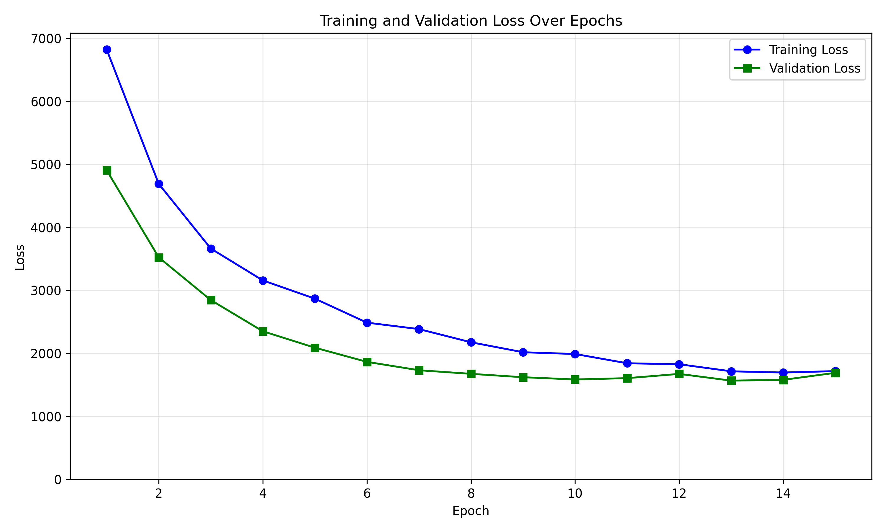 |  |

**Before pretraining**
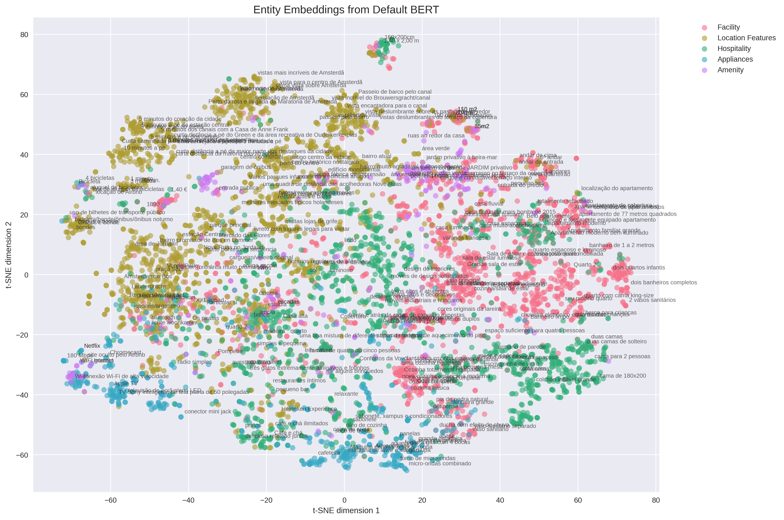 

**After pretraining**
(theres an error in the title, its pretrained not fine tuned BERT)
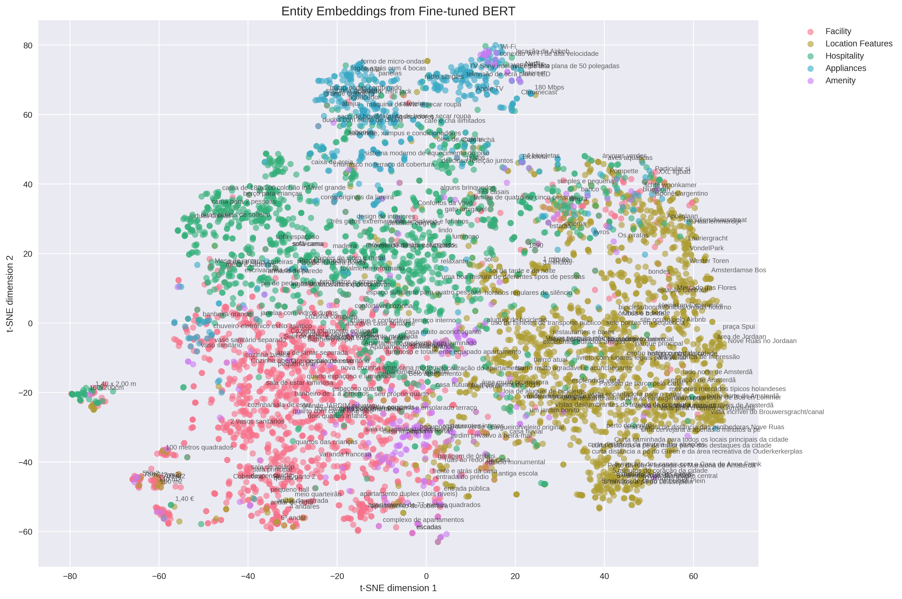 

**Embeddings Space quality validation (after pretraining)**

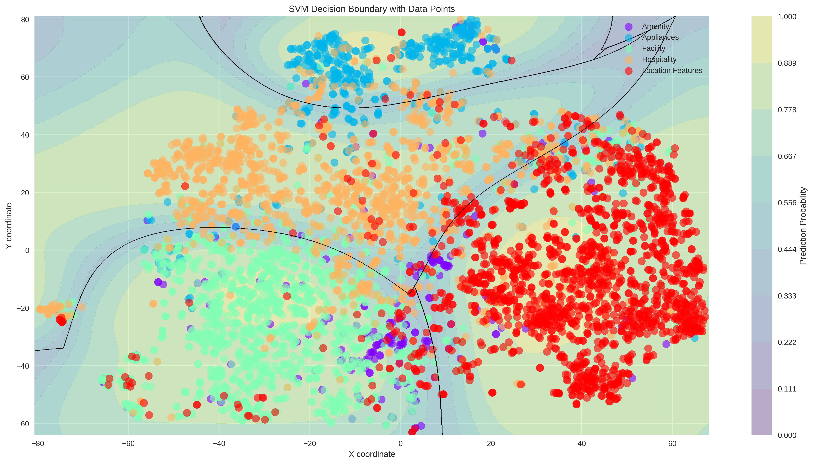

**After fine tuning**
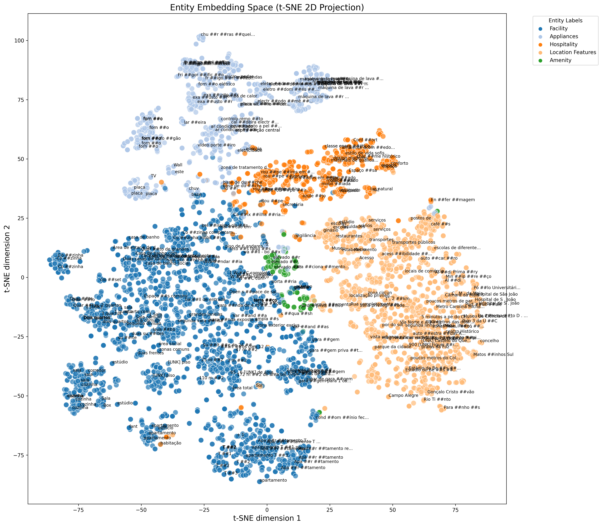

#### Label metrics

| Label Metrics | Confusion Matrix |
|:---:|:---:|
| 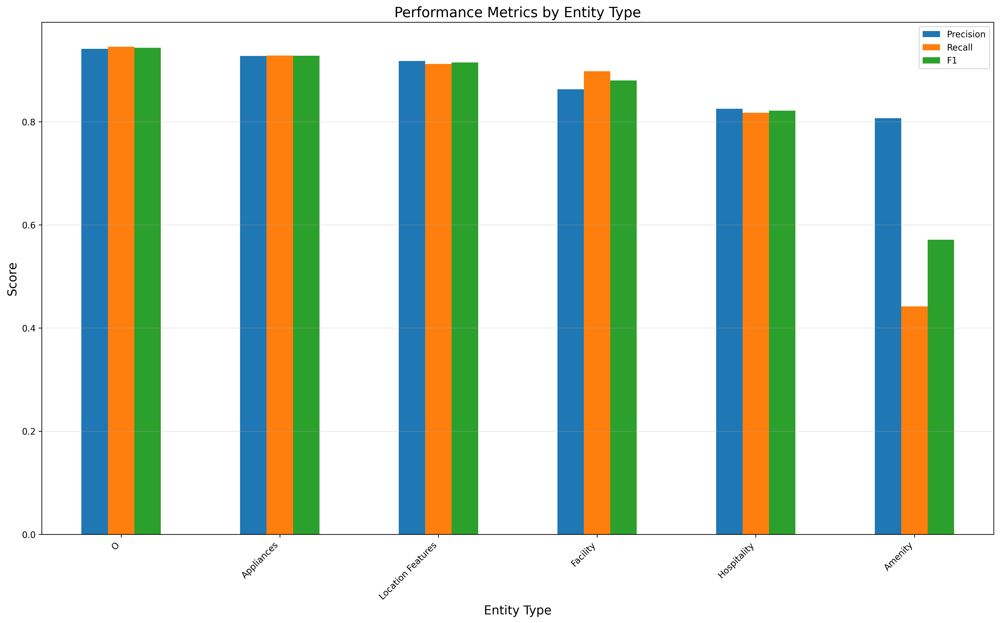 | 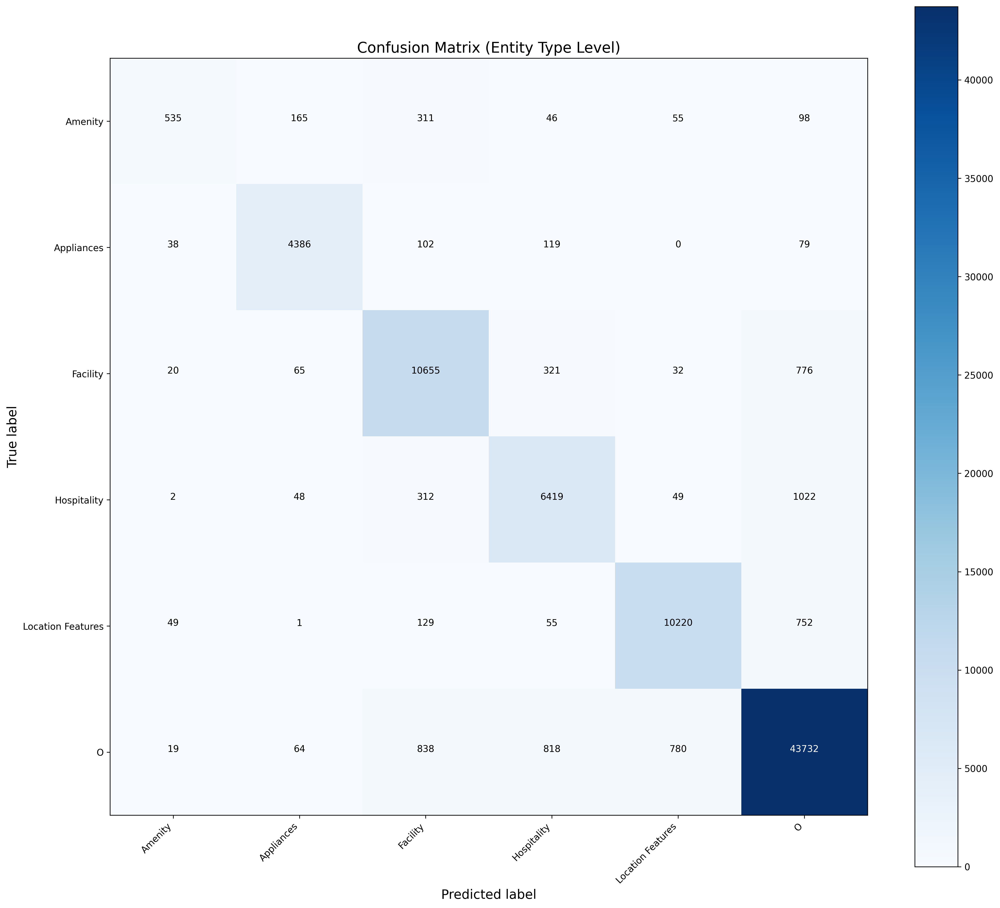 |

| Top 20 entities by label | Total entities per label |
|:---:|:---:|
| 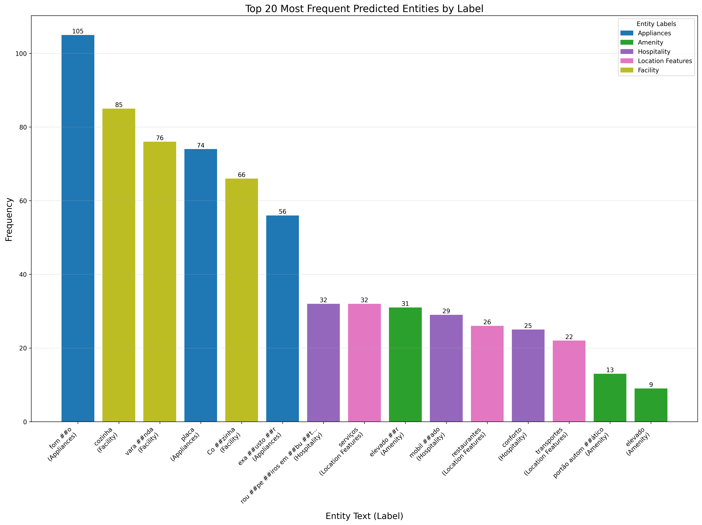 | 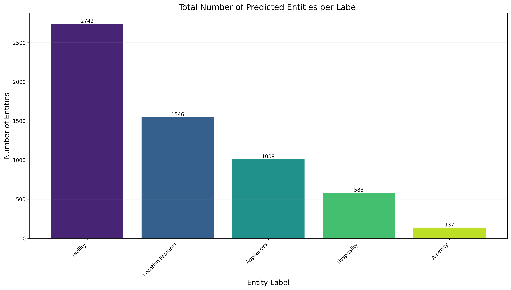 |


<div style="padding: 1.2em; margin: 1.2em 0; border-left: 6px solid #D14B4B; background-color: #FFEFEF; border-radius: 0.3em; box-shadow: 0 2px 4px rgba(0,0,0,0.05);"> <p style="font-weight: bold; font-size: 1.3em; margin-top: 0; margin-bottom: 0.8em; color: #D14B4B; border-bottom: 1px solid rgba(209,75,75,0.2); padding-bottom: 0.4em;">Conclusions</p> <p style="margin: 0.6em 0; line-height: 1.5; font-size: 1.05em;">The target dataset outperforms the translated training dataset in terms of embedding quality and class separation. Clear patterns and semantic alignment indicate a stronger signal-to-noise ratio in the target data.</p> <p style="margin: 0.6em 0; line-height: 1.5; font-size: 1.05em;"><strong style="color: #333;">Translation Losses:</strong> Translated data introduces noise through <span style="font-style: italic; background-color: rgba(209,75,75,0.1); padding: 0 3px;">context loss</span>, <span style="font-style: italic; background-color: rgba(209,75,75,0.1); padding: 0 3px;">idiomatic inaccuracies</span>, and <span style="font-style: italic; background-color: rgba(209,75,75,0.1); padding: 0 3px;">ambiguities</span>, which blur feature distinctions and harm learning.</p> <p style="margin: 0.6em 0; line-height: 1.5; font-size: 1.05em;"><strong style="color: #333;">Ambiguous Expressions:</strong> Less unique entities in the target database ultimately helps. While algorithms might chose different synonyms for the same words, native speakers are usually very keen on using the same expressions.</p> <p style="margin: 0.8em 0; font-size: 1.1em;"><strong style="color: #333;">Key Observations:</strong></p> <ul style="margin: 0.6em 0 0.8em 1.5em; line-height: 1.6;"> <li>Target embeddings exhibit clearer class definitions and reduced ambiguity.</li> <li>Native Portuguese expressions enhance context relevance and discriminative power.</li> <li>Translated data introduces noise that hampers embedding clarity and model training.</li> </ul> <p style="margin: 0.8em 0; line-height: 1.5; font-size: 1.05em; border-top: 1px solid rgba(209,75,75,0.2); padding-top: 0.6em;">Translation here acts as a data augmentar and regularization mechanisms as it introduces variability and noise to the data.</p> </div>

<div style="font-family: sans-serif; line-height: 1.6;">
  <h2 style="text-align: center; margin-bottom: 20px;">Model Performance Comparison</h2>
  <div style="display: flex; justify-content: space-between; gap: 20px; margin-bottom: 30px;">
    <div style="flex: 1; border: 1px solid #ccc; padding: 15px; border-radius: 8px; background-color: #f9f9f9;">
      <h3 style="margin-top: 0; color: #333; border-bottom: 2px solid #eee; padding-bottom: 10px;">LAEP-CNN Model Baseline Scores</h3>
      <table style="width: 100%; border-collapse: collapse; font-size: 0.9em;">
        <thead>
          <tr>
            <th style="border: 1px solid #ddd; padding: 8px; text-align: left; background-color: #e9e9e9;">Entity</th>
            <th style="border: 1px solid #ddd; padding: 8px; text-align: left; background-color: #e9e9e9;">Precision</th>
            <th style="border: 1px solid #ddd; padding: 8px; text-align: left; background-color: #e9e9e9;">Recall</th>
            <th style="border: 1px solid #ddd; padding: 8px; text-align: left; background-color: #e9e9e9;">F1 Score</th>
          </tr>
        </thead>
        <tbody>
          <tr>
            <td style="border: 1px solid #ddd; padding: 8px; text-align: left;"><strong>Overall</strong></td>
            <td style="border: 1px solid #ddd; padding: 8px; text-align: left;">75.95%</td>
            <td style="border: 1px solid #ddd; padding: 8px; text-align: left;">74.70%</td>
            <td style="border: 1px solid #ddd; padding: 8px; text-align: left;">75.32%</td>
          </tr>
          <tr>
            <td style="border: 1px solid #ddd; padding: 8px; text-align: left;"><strong>Amenity</strong></td>
            <td style="border: 1px solid #ddd; padding: 8px; text-align: left;">80.75%</td>
            <td style="border: 1px solid #ddd; padding: 8px; text-align: left;">84.38%</td>
            <td style="border: 1px solid #ddd; padding: 8px; text-align: left;">82.52%</td>
          </tr>
          <tr>
            <td style="border: 1px solid #ddd; padding: 8px; text-align: left;"><strong>Facility</strong></td>
            <td style="border: 1px solid #ddd; padding: 8px; text-align: left;">74.15%</td>
            <td style="border: 1px solid #ddd; padding: 8px; text-align: left;">67.66%</td>
            <td style="border: 1px solid #ddd; padding: 8px; text-align: left;">70.76%</td>
          </tr>
          <tr>
            <td style="border: 1px solid #ddd; padding: 8px; text-align: left;"><strong>Hospitality</strong></td>
            <td style="border: 1px solid #ddd; padding: 8px; text-align: left;">61.99%</td>
            <td style="border: 1px solid #ddd; padding: 8px; text-align: left;">58.47%</td>
            <td style="border: 1px solid #ddd; padding: 8px; text-align: left;">60.18%</td>
          </tr>
          <tr>
            <td style="border: 1px solid #ddd; padding: 8px; text-align: left;"><strong>Location features</strong></td>
            <td style="border: 1px solid #ddd; padding: 8px; text-align: left;">71.80%</td>
            <td style="border: 1px solid #ddd; padding: 8px; text-align: left;">63.19%</td>
            <td style="border: 1px solid #ddd; padding: 8px; text-align: left;">67.22%</td>
          </tr>
          <tr>
            <td style="border: 1px solid #ddd; padding: 8px; text-align: left;"><strong>Structural details</strong></td>
            <td style="border: 1px solid #ddd; padding: 8px; text-align: left;">72.66%</td>
            <td style="border: 1px solid #ddd; padding: 8px; text-align: left;">68.49%</td>
            <td style="border: 1px solid #ddd; padding: 8px; text-align: left;">70.51%</td>
          </tr>
        </tbody>
      </table>
    </div>

  <div style="flex: 1; border: 1px solid #ccc; padding: 15px; border-radius: 8px; background-color: #f9f9f9;">
      <h3 style="margin-top: 0; color: #333; border-bottom: 2px solid #eee; padding-bottom: 10px;">Our BERT Model Scores</h3>
      <table style="width: 100%; border-collapse: collapse; font-size: 0.9em;">
        <thead>
          <tr>
            <th style="border: 1px solid #ddd; padding: 8px; text-align: left; background-color: #e9e9e9;">Class</th>
            <th style="border: 1px solid #ddd; padding: 8px; text-align: left; background-color: #e9e9e9;">Precision</th>
            <th style="border: 1px solid #ddd; padding: 8px; text-align: left; background-color: #e9e9e9;">Recall</th>
            <th style="border: 1px solid #ddd; padding: 8px; text-align: left; background-color: #e9e9e9;">F1 Score</th>
            <th style="border: 1px solid #ddd; padding: 8px; text-align: left; background-color: #e9e9e9;">Support</th>
          </tr>
        </thead>
        <tbody>
          <tr>
            <td style="border: 1px solid #ddd; padding: 8px; text-align: left;">Amenity</td>
            <td style="border: 1px solid #ddd; padding: 8px; text-align: left;">76.00%</td>
            <td style="border: 1px solid #ddd; padding: 8px; text-align: left;">47.00%</td>
            <td style="border: 1px solid #ddd; padding: 8px; text-align: left;">57.00%</td>
            <td style="border: 1px solid #ddd; padding: 8px; text-align: left;">221</td>
          </tr>
          <tr>
            <td style="border: 1px solid #ddd; padding: 8px; text-align: left;">Appliances</td>
            <td style="border: 1px solid #ddd; padding: 8px; text-align: left;">79.00%</td>
            <td style="border: 1px solid #ddd; padding: 8px; text-align: left;">69.00%</td>
            <td style="border: 1px solid #ddd; padding: 8px; text-align: left;">74.00%</td>
            <td style="border: 1px solid #ddd; padding: 8px; text-align: left;">498</td>
          </tr>
          <tr>
            <td style="border: 1px solid #ddd; padding: 8px; text-align: left;">Facility</td>
            <td style="border: 1px solid #ddd; padding: 8px; text-align: left;">79.00%</td>
            <td style="border: 1px solid #ddd; padding: 8px; text-align: left;">83.00%</td>
            <td style="border: 1px solid #ddd; padding: 8px; text-align: left;">81.00%</td>
            <td style="border: 1px solid #ddd; padding: 8px; text-align: left;">1551</td>
          </tr>
          <tr>
            <td style="border: 1px solid #ddd; padding: 8px; text-align: left;">Hospital</td>
            <td style="border: 1px solid #ddd; padding: 8px; text-align: left;">74.00%</td>
            <td style="border: 1px solid #ddd; padding: 8px; text-align: left;">77.00%</td>
            <td style="border: 1px solid #ddd; padding: 8px; text-align: left;">75.00%</td>
            <td style="border: 1px solid #ddd; padding: 8px; text-align: left;">1349</td>
          </tr>
          <tr>
            <td style="border: 1px solid #ddd; padding: 8px; text-align: left;">Location</td>
            <td style="border: 1px solid #ddd; padding: 8px; text-align: left;">83.00%</td>
            <td style="border: 1px solid #ddd; padding: 8px; text-align: left;">89.00%</td>
            <td style="border: 1px solid #ddd; padding: 8px; text-align: left;">86.00%</td>
            <td style="border: 1px solid #ddd; padding: 8px; text-align: left;">1714</td>
          </tr>
          <tr style="line-height: 0.5;">
            <td colspan="5" style="padding: 0px; border: none;"></td>
          </tr>
          <tr>
            <td style="border: 1px solid #ddd; padding: 8px; text-align: left;">Accuracy</td>
            <td colspan="2" style="border: 1px solid #ddd; padding: 8px; text-align: left;"></td>
            <td style="border: 1px solid #ddd; padding: 8px; text-align: left;">79.00%</td>
            <td style="border: 1px solid #ddd; padding: 8px; text-align: left;">5333</td>
          </tr>
          <tr>
            <td style="border: 1px solid #ddd; padding: 8px; text-align: left;">Macro</td>
            <td style="border: 1px solid #ddd; padding: 8px; text-align: left;">76.00%</td>
            <td style="border: 1px solid #ddd; padding: 8px; text-align: left;">64.00%</td>
            <td style="border: 1px solid #ddd; padding: 8px; text-align: left;">63.00%</td>
            <td style="border: 1px solid #ddd; padding: 8px; text-align: left;">5333</td>
          </tr>
          <tr>
            <td style="border: 1px solid #ddd; padding: 8px; text-align: left;">Weighted</td>
            <td style="border: 1px solid #ddd; padding: 8px; text-align: left;">76.00%</td>
            <td style="border: 1px solid #ddd; padding: 8px; text-align: left;">79.00%</td>
            <td style="border: 1px solid #ddd; padding: 8px; text-align: left;">77.00%</td>
            <td style="border: 1px solid #ddd; padding: 8px; text-align: left;">5333</td>
          </tr>
        </tbody>
      </table>
    </div>
  </div>
</div>

**These models are not comparable since the dataset and NER definitions are very different**
The pretrained encoder should create semantically meaningful embeddings. These embeddings should show clearn clusters by entity types and a classification algorithm such as SVM decision boundaries should be able to help validate these clusters semantic sense.

Outliers might indicate data quality issues:
- **mislabled entities** in training data
- unusual but valid entities which are feature rich
- **noise** that should be cleaned

Data quality improvement actions:
- Review entity's label accuracy
- Identify systematic labeling errors
- Remove or relabel incorrect instances

<div style="padding: 1.2em; margin: 1.2em 0; border-left: 6px solid #4B56D2; background-color: #EEF1FF; border-radius: 0.3em; box-shadow: 0 2px 4px rgba(0,0,0,0.05);">
  <p style="font-weight: bold; font-size: 1.3em; margin-top: 0; margin-bottom: 0.8em; color: #4B56D2; border-bottom: 1px solid rgba(75,86,210,0.2); padding-bottom: 0.4em;">Analysis</p>
  <p style="margin: 0.6em 0; line-height: 1.5; font-size: 1.05em;">We can conclude the entities are generally well learnt and with show meaningful representation. Its possible to see clear outliers, that is, entities which are assigned to the wrong label; its possible to see the boundary entities and where each label is semantically connected to other label. However, an important note is the <span style="font-style: italic; background-color: rgba(75,86,210,0.1); padding: 0 3px;">Amenity</span> type label, which is an obvious stand out because it has a sparse representations and its features we're not learnt by the model.
  Possible cause include: undersampling and under-represented, with only less than 300 samples; its semantic definition is not well defined and overlaps with other labels.</p>
  <p style="margin: 0.8em 0; font-size: 1.1em;"><strong style="color: #333;">Key observations:</strong></p>
  <ul style="margin: 0.6em 0 0.8em 1.5em; line-height: 1.6;">
    <li>Labels show a very clear definition in the embeddings space</li>
    <li>Model captured semantic rich patterns and relevant context information</li>
    <li>Amenity label has no semantical definition and overlaps with other labels, which will be harmful during fine tuning (NER)</li>
  </ul>
  <p style="margin: 0.8em 0; line-height: 1.5; font-size: 1.05em; border-top: 1px solid rgba(75,86,210,0.2); padding-top: 0.6em;">Further investigation into the semantic similarity between frequently confused entities may help improve model performance.</p>
</div>

# Future work

- Improve deduplication algorithm for near duplicates
- Improve translation algorithm to preserve language and semantics
- Reassess label classes definition to avoid overlaps, specially on 'Amenity'
- Remove or relabel incorrect entities
- Apply this data mining model to imovirtual joining with the tabular data from the listing to get meaningful data. 
