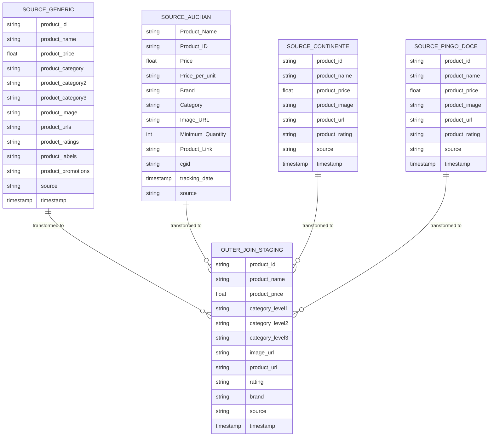
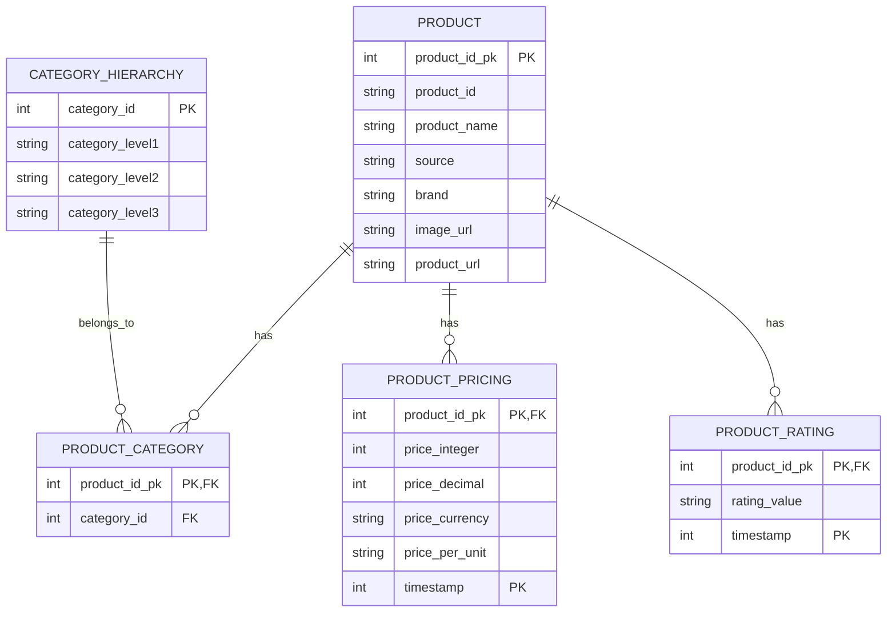
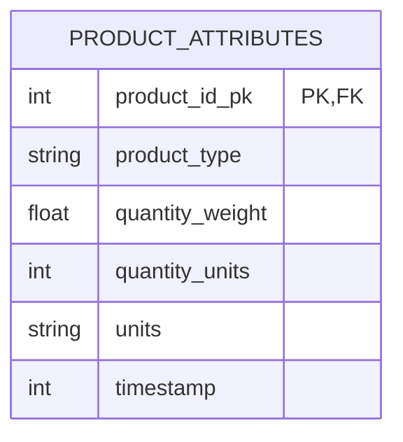

## Ingestion Layer

- Staging Layer belongs to first layer of Postgres database;
- Staging Layer has a relaxed format resulting of the outer join of source schemas
- Staging Layer has a small retention period (less than 1 month)

## Structured layer

- Product pricing was quantized due to supabase 500MB limits
- Data types optimized

## Augmented layer

