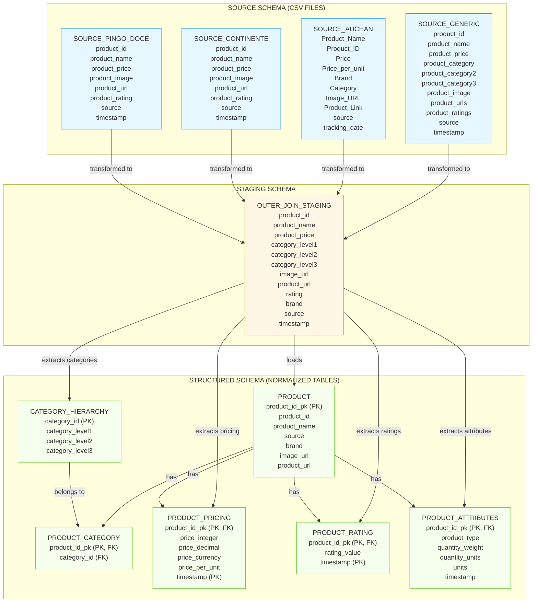
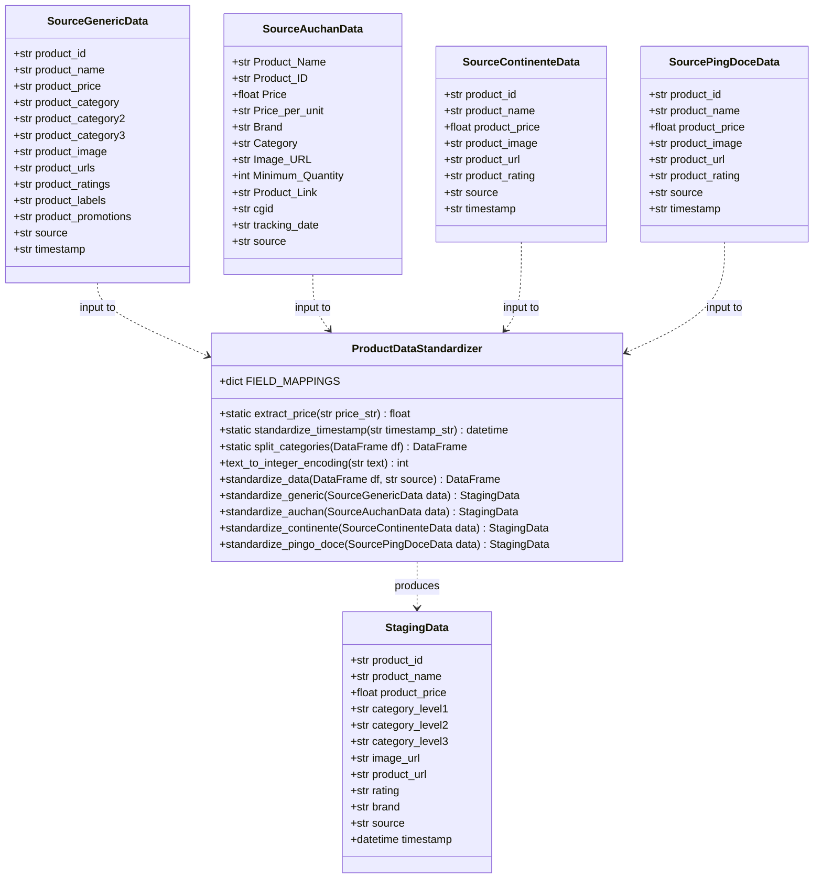

# Migrating ETL to ELT pipeline

-----------------------------------------------------------
Problem: Migrate a resource constrainted pipeline to Google Cloud. The current pipeline is hosted in BlackBlaze for blob storage and Supabase for SQL database (postgres). The bottleneck is currently the the SQL database and the BlackBlaze 1GB day networking.

Current design:
Scraping (GitHub Actions): Generates raw data as numerous small CSVs, logically grouped by category.

ETL Bottleneck (GitHub Actions): A Python script transforms these CSVs into structured dataframes and attempts to load them into Supabase Postgres. This critical step is chained to the scraping job.
Serving Layer (REST API): Connects directly to the constrained Supabase DB.

Issues:
The Egress Chokehold: BlackBlaze's 1GB daily limit isn't just a constraint; it's a hard stop, often hit mid-process during essential backfills or large updates.

Database Dead End: The 500MB Supabase limit means we're constantly managing data size instead of focusing on value. Scaling isn't an option here.

I/O & Network Thrashing: Processing hundreds or thousands of tiny CSVs hammers both storage I/O and network bandwidth unnecessarily.

ETL Fragility & The Atomicity Trap: The "all-or-nothing" nature of the current ETL job means a single failure in processing one category's CSVs often halts the entire batch, leading to data gaps, manual reruns, and operational headaches. This tight coupling and pre-load transformation is brittle.

Pipeline Observability: it's awful not to use a traditional data engineering tool such as dagster, airflow, prefect, etc.

Fix:
- Solve the Egress/Networking limits: Post process raw .csv into a compiled parquet file before uploading to file storage (ensures backward compatibility, reduces IO network operations)
- Postgres + Dbt: Move ETL job to SQL with ELT approach
- Get rid of tight coupling jobs: Decouple jobs by implementing partial (differential lods) by ingestion date.

## Pipeline ERD

## Pipeline Class Diagram

