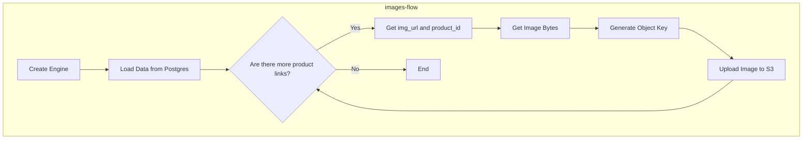
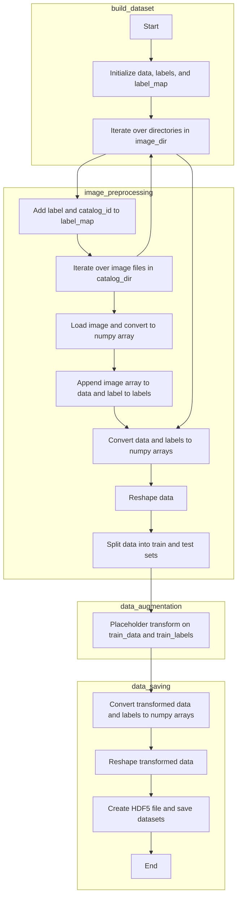

# 01: Creating a Image Classification Dataset from Vinted Images

In this chapter I'm going to show how I built an image clothing dataset from my Vinted data engineering pipeline.

## Introduction

As referenced in my Vinted Data Engineering Chapter, one of the data pipelines developed stored the item images in S3 buckets. About 10k images were collected during the short run of the pipeline (it's no longer active) with over 500 classes. That's a huge problem, the dataset is way too small to create a good classifier at first glance (it's pretty obvious, right?).


In addition, there is another very obvious issue with the images which is its lack of standardization.


Some of the issues are:

- Different focal lengths
- Class imbalance
- People in the photo
- Diverse backgrounds
- Different camera angles
- Misc: lightning conditions, camera quality, "specificness" of the item (show several, etc)

It's really a nightmarish issue to solve. Actually, the easiest way to solve this is to solve it statistically: assume most pictures are accurate and get a huge dataset. :D


## Data Mining

There's no data without mining it first. I didn't go into detail to every pipeline, but now I will go more into detail about the **images-flow** pipeline.

### Overview of images-flow pipeline

```{note}
Disclaimer: not my proudest data engineering development, but it does the work. 

It has a redundant design but it works OK.
```



The pipeline scans the postgres table and returns product links of size *sample_size*. It then loops over the items, making a request to Vinted API for every link in the data. Finally it stored the data by product_id unique tag in the S3 bucket.


I had to cap the sample_size because I had multiple pipeline running asynchronously. 


```python
@flow(name="Flow for images.", 
      flow_run_name= "Flow for images",
      log_prints= True,
      timeout_seconds = 30)
def images_flow(server_conn_string):
    s3 = boto3.client('s3',
            aws_access_key_id='',
            aws_secret_access_key='',
            region_name='')
    engine = create_engine(server_conn_string)
    data = load_data_from_postgres(engine= engine, sample_size= 10)
    for img_url, product_id in zip(data["image"], data["product_id"]):
        image_bytes = get_image_bytes(img_url)
        object_key = str(product_id) + ".jpeg"
        upload_image_to_s3(s3 = s3, 
                           image = image_bytes, 
                           bucket_name = "vinted-images", 
                           object_key = object_key) # need to make sure the format is string

    return
```

**Limitations**
I'm going to be upfront with the limitations:

- Redundant calls. I'm looking at product_ids that possibly I have already in S3. Given that API calls are the bottleneck here, it's insanely expensive mistake.
- I'm only collecting the first image for each product_id (this is more of a design choice)
- I ran this just a couple of days for a few hours each day


## Pytorch Dataset Creation

Source: https://pytorch.org/tutorials/beginner/data_loading_tutorial.html

There are quite a few steps in this process. First we need to make a new project with the data and required libraries. Arguably it would have been better to use SageMaker as the data was in the cloud and It has a pre built API for dataset creations but I've blown way too much money this month already on Cloud.

Steps:

- [1] Get the data and data labels
- [2] Create a directory for each label and group the data in each category (optional)
- [3] Create a HDF5 (hierarchical data format), standard for datasets
- [4] Create a custom Dataset DataClass
- [5] Load the data with Dataloader

### Get the data and data labels

I need to fetch data from 2 sources:

- RDS for the image labels
- S3 for the images

#### Images

S3 is a hassle when buckets are multipage (over 1k). Just a heads up. I also made some preprocessing transforms to reduce the size of the data.

- Convert to grayscale
- Resize to 128 x 128

```python
def download_and_rescale_images(client, bucket_name, local_dir, size=(128, 128)):

    if not os.path.exists(local_dir):
        os.makedirs(local_dir)

    paginator = s3.get_paginator('list_objects_v2')
    pages = paginator.paginate(Bucket='bucket', Prefix='prefix')

    # since my bucket has +1k items
    for page in pages:
        for obj in page['Contents']:
            key = obj['Key']
            local_file_path = os.path.join(local_dir, os.path.basename(key))

            # Download the image from S3
            s3_response = client.get_object(Bucket=bucket_name, Key=key)
            image_data = s3_response['Body'].read()

            with Image.open(BytesIO(image_data)) as img:
                # preprocess
                img = img.resize(size)
                img = remove(img)
                img = img.convert('RGB')
                try:
                    img.save(local_file_path)
                    print(f"Downloaded and rescaled image saved to {local_file_path}")
                except:
                    img.save(local_file_path, "jpeg")
```


#### Labels

Just a simple query to my AWS RDS instance and store it locally as csv.

```python
query = "SELECT DISTINCT(product_id), catalog_id FROM tracking_staging"
```

### Create a data catalog

This is where we create a directory for each category. To be fair it is optional but I find it useful.

```python
def create_label_cluster_folders_and_copy_images(merged_df: pd.DataFrame, image_dir: str) -> None:
    """
    Creates folders based on catalog_id and copies images to corresponding folders.

    Args:
    merged_df (pd.DataFrame): DataFrame containing product_id and catalog_id columns.
    image_dir (str): The directory containing processed JPEG images.
    """
    label_dir = os.path.join(image_dir, 'cluster')

    if not os.path.exists(label_dir):
        os.makedirs(label_dir)

    for _, row in merged_df.iterrows():
        product_id = row['product_id']
        catalog_id = row['catalog_id'] 


        catalog_dir = os.path.join(label_dir, str(int(catalog_id)))
        if not os.path.exists(catalog_dir):
            os.makedirs(catalog_dir)


        src_path = os.path.join(image_dir, 'processed', f"{str(int(product_id))}.jpeg")
        dest_path = os.path.join(catalog_dir, f"{str(int(product_id))}.jpeg")


        if os.path.exists(src_path):
            shutil.copy(src_path, dest_path)
            print(f"Copied {src_path} to {dest_path}")
        else:
            print(f"Source file {src_path} does not exist")
```

**Output**

- Over 701 folders tagged by catalog id number.
- 8129 images
- Size variable, depending on preprocessing (image scaling, compression and colours)


### Create a HDF5 for the dataset

HDF5 files can store data in a hierarchical format, similar to a file system. This structure allows for organizing datasets in a logical and accessible manner. Data can be organized into groups and datasets, making it easy to navigate and retrieve specific pieces of data.


For this purpose, we will divide the dataset into 4 groups:

- Train data
- Train labels
- Test data
- Test labels
- Label map

```{important}
<b>Chunking and OOM datasets</b>

For big datasets (out of memory datasets) it's important to process the dataset in batches, otherwise you will run out of memory really fast. The way to do this is by using chunks.
```

```{note}
<b>Train test split</b>
You need to make sure to create **two splits between train and test** if you are going to apply any sort of data augmentation procedure, otherwise you are going to polute the test data leading to overfitting/skewed results.


<b>Stratified splits</b>
In the train_test_split, you should use stratified sampling making sure the test set is representative of model performance.
```

#### Overview of my solution




```python
def build_dataset(image_dir: str, output_file: str, test_size=0.2, chunk_size=100):
    """
    Build a dataset from images in the directory and save it as an HDF5 file with chunking.

    Args:
    image_dir (str): The base directory containing label subdirectories.
    output_file (str): Path to the output HDF5 file.
    test_size (float): Proportion of the dataset to include in the test split.
    chunk_size (int): Number of images to process in each chunk.
    """
    data = []
    labels = []
    label_map = {}

    for label, catalog_id in tqdm(enumerate(sorted(os.listdir(image_dir)))):
        catalog_dir = os.path.join(image_dir, catalog_id)
        if not os.path.isdir(catalog_dir):
            continue

        label_map[label] = catalog_id

        for image_name in os.listdir(catalog_dir):
            if image_name.lower().endswith('.jpg') or image_name.lower().endswith('.jpeg'):
                image_path = os.path.join(catalog_dir, image_name)
                img = Image.open(image_path).convert('L')  # Ensure image is in grayscale
                img = img.resize((128, 128))  # Ensure image is resized to 128x128
                img_array = np.array(img)
                img_array = img_array.reshape((128, 128, 1)) # double check
                data.append(img_array)
                labels.append(label)

                if len(data) >= chunk_size:
                    data = np.array(data).reshape(-1, 128, 128, 1)
                    labels = np.array(labels)
                    train_data, test_data, train_labels, test_labels = train_test_split(data, labels, test_size=test_size, stratify = True)

                    augmented_train_data = []
                    augmented_train_labels = []

                    for img, label in zip(train_data, train_labels):
                        # prototype of augmentation function applied per image
                        # you can apply yours
                        augmented_images = augment_image(img, 
                                    flip_probability=0.5, 
                                    rotate_probability=0.5, rotate_max=20, rotate_min=-20, 
                                    translate_probability=0.5, translate_max=10, translate_min=-10,
                                    multiplier=5,
                                    blur_probability=0.5,
                                    kernel_size_range=(1, 5),
                                    noise_probability=0.5,
                                    mean=0,
                                    stddev=0.1)
                        
                        for aug_img in augmented_images:
                            aug_img = aug_img.reshape((128, 128, 1))  # triple check
                            augmented_train_data.append(aug_img)
                            augmented_train_labels.append(label)

                    augmented_train_data = np.array(augmented_train_data).reshape(-1, 128, 128, 1)
                    augmented_train_labels = np.array(augmented_train_labels)

                    with h5py.File(output_file, 'a') as f:
                        if 'train_images' in f:
                            # f['train_images'].resize((f['train_images'].shape[0] + augmented_train_data.shape[0]), axis=0)
                            f['train_images'][-augmented_train_data.shape[0]:] = augmented_train_data
                            # f['train_labels'].resize((f['train_labels'].shape[0] + augmented_train_labels.shape[0]), axis=0)
                            f['train_labels'][-augmented_train_labels.shape[0]:] = augmented_train_labels
                        else:
                            f.create_dataset('train_images', data=augmented_train_data, maxshape=(None, 128, 128, 1), chunks=True)
                            f.create_dataset('train_labels', data=augmented_train_labels, maxshape=(None,), chunks=True)

                        if 'test_images' in f:
                            # f['test_images'].resize((f['test_images'].shape[0] + test_data.shape[0]), axis=0)
                            f['test_images'][-test_data.shape[0]:] = test_data
                            # f['test_labels'].resize((f['test_labels'].shape[0] + test_labels.shape[0]), axis=0)
                            f['test_labels'][-test_labels.shape[0]:] = test_labels
                        else:
                            f.create_dataset('test_images', data=test_data, maxshape=(None, 128, 128, 1), chunks=True)
                            f.create_dataset('test_labels', data=test_labels, maxshape=(None,), chunks=True)

                    data = []
                    labels = []

    # label map
    with h5py.File(output_file, 'a') as f:
        if 'label_map' in f:
            del f['label_map'] # im not sure this is necessary though
        f.create_dataset('label_map', data=np.array([f"{label},{catalog_id}".encode('utf-8') for label, catalog_id in label_map.items()]))

```

The function goes through all folders sequentially and gets each image individually. Converts to a numpy array, procs preprocessing steps such as resizing and grayscale and collects these images until the chunk reaches the max chunk size.


The the chunk is split in traning and test sets by test set proportion. The training set is passed through a data augmentation function (optional) whereas the test set doesn't.


The chunk is appended to the dataset by indexing and finally the label dictionary is appended as well.


- [x] OOM image processing with variable chunks
- [x] Support for training set augmentation
- [x] Tracking of label dict


All in all, it supports the creation of small (<100gb) datasets with decent scalability.

#### Visualizing the ouput

Once again, be careful when working with huge datasets, don't try to load the whole dataset in memory.


```python
def load_random(file_path, chunk_size):
    # example implementation of sampling a chunk for inspection
    with h5py.File(file_path, 'r') as f:
        total_samples = len(f['test_images'])
        indices = np.arange(total_samples)
        print(indices)
        np.random.shuffle(indices)
        selected_indices = indices[:chunk_size]

        images = np.array(f['test_images'][sorted(selected_indices)]) # make sure its sorted, you cant access indexes if they are all over the place 
        labels = np.array(f['test_labels'][sorted(selected_indices)])

        label_map = dict([eval(label.decode('utf-8')) for label in f['label_map']])
        
    return images, labels, label_map
```


### Wrapping up

#### Custom DataClass

    All datasets that represent a map from keys to data samples should subclass
    it. All subclasses should overwrite :meth:`__getitem__`, supporting fetching a
    data sample for a given key. Subclasses could also optionally overwrite
    :meth:`__len__`, which is expected to return the size of the dataset by many
    :class:`~torch.utils.data.Sampler` implementations and the default options
    of :class:`~torch.utils.data.DataLoader`.

Pytorch defined a Dataset dataclass to access your data. You need the implementations of these pythonic methods because they are used during training to both iterate over data OOM and fetch data by index:

- __get__item
- __ add__
 
I also recommend:

- __ len__
- num_labels (optional)


The Dataset class then fits and is used in DataLoader, which loads your dataset incrementally.


```python
class CustomDataset(Dataset):
    def __init__(self, images: np.ndarray, labels: np.ndarray, transform=None):
        self.images = images
        self.labels = labels
        self.transform = transform

    # optional
    def __len__(self):
        return len(self.images)

    def __getitem__(self, idx: int):
        image = self.images[idx]
        label = self.labels[idx]

        if self.transform:
            # i added this to convert to tensor
            # transforms.ToTensor()
            # but it works as a Sklearn pipeline, you can pipeline a lot of transformations using torch.transforms
            image = self.transform(image)

        return torch.tensor(image, dtype=torch.float32), torch.tensor(label, dtype=torch.long)
    
    # optional
    def get_num_labels(self):
        # you can access this by label dictionary as well, you dont need this
        return len(np.unique(self.labels))
```