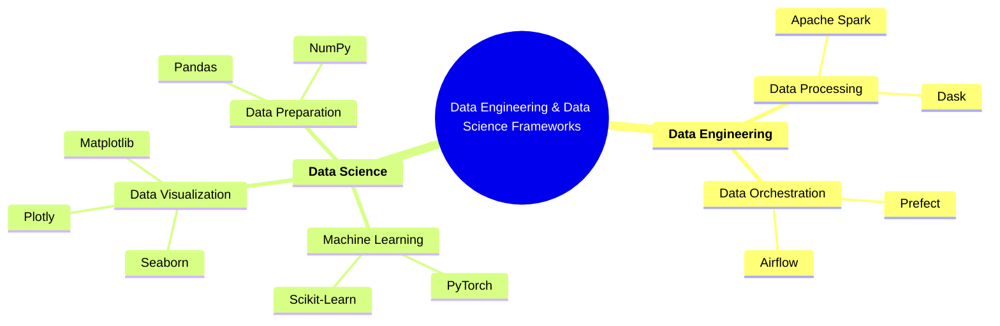

# Introduction

Hi! My name is Miguel, a Industrial Engineer graduate with post graduate degree in Data Analytics. I'm a sucker for mathematics and its applications, with a soft spot for programming.


As an industrial engineer, my approach focuses on **processes**, code and model resusability and streamlining solutions. I'm an advocate for Out of the Box solutions.


My main interests are: financial modelling, computer vision and data mining. [Miguel Silva](https://miguelsilva.netlify.app/).


Some high effort projects of my own. Hope you like it.



```{tableofcontents}
```
